# Agent 设计模式全景（大纲版）

> 目标：用 **Python 从 0 到 1** 实现市面上常见/常用的 Agent Design Patterns（含编排、可靠性、验证、记忆、安全、观测等横切模式）。  
> 本文是“报告大纲 + 最小流程图合集”：每个模式讲清 **它是什么**、**为了解决什么问题而诞生**、以及 **一个最小可实现的流程**（Mermaid）。

**更新日期**：2026-04-25  
**阅读提示**：这些模式高度“可组合”。实际系统通常不是选一个，而是把几个模式叠在一起（例如：Routing + RAG + Agent Loop + Guardrails + HITL + Tracing）。

---

## 0. 术语快速对齐

- **Workflow（工作流）**：下一步由代码/配置固定（或有限分支），稳定、可测、易控。
- **Agent（代理）**：下一步由模型基于状态动态决定（工具/计划/改写/交接等），更灵活但更难控。
- **Pattern（设计模式）**：可复用的“控制流 + 状态组织 + 约束边界”的解决方案。

---

## 1. 全局地图：主干演化 + 横切能力

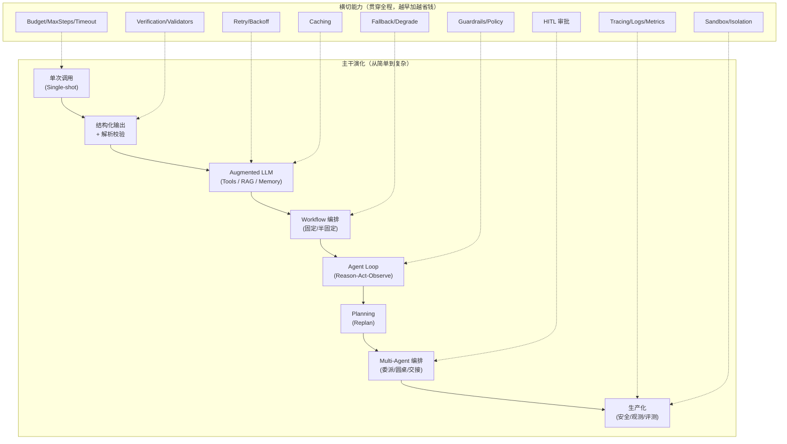
```mermaid
flowchart TB
  subgraph Main["主干演化（从简单到复杂）"]
    A["单次调用\n(Single-shot)"] --> B["结构化输出\n+ 解析校验"]
    B --> C["Augmented LLM\n(Tools / RAG / Memory)"]
    C --> D["Workflow 编排\n(固定/半固定)"]
    D --> E["Agent Loop\n(Reason-Act-Observe)"]
    E --> F["Planning\n(Replan)"]
    F --> G["Multi-Agent 编排\n(委派/圆桌/交接)"]
    G --> H["生产化\n(安全/观测/评测)"]
  end

  subgraph X["横切能力（贯穿全程，越早加越省钱）"]
    X1["Budget/MaxSteps/Timeout"]
    X2["Retry/Backoff"]
    X3["Fallback/Degrade"]
    X4["Caching"]
    X5["Verification/Validators"]
    X6["Guardrails/Policy"]
    X7["HITL 审批"]
    X8["Tracing/Logs/Metrics"]
    X9["Sandbox/Isolation"]
  end

  X1 -.-> A
  X2 -.-> C
  X3 -.-> D
  X4 -.-> C
  X5 -.-> B
  X6 -.-> E
  X7 -.-> G
  X8 -.-> H
  X9 -.-> H
```

---

## 2. 报告结构（建议目录）

1) 核心运行时模式（最小 agent runtime）  
2) Workflow 编排模式（固定/半固定的控制流）  
3) Agent Loop 与状态模式（让 agent 可控、可回放）  
4) 规划与分解模式（Plan/Execute/Replan）  
5) 多智能体编排模式（委派/圆桌/交接/层级）  
6) 检索与研究写作模式（RAG / GraphRAG / STORM）  
7) 记忆模式（短期/长期/session）  
8) 验证与可靠性模式（CoVe、投票、重试、熔断）  
9) 安全与治理模式（guardrails、沙箱、审批、工具策略）  
10) 可观测与评测模式（tracing、eval harness）  

---

## 3. 核心运行时模式（从 0 到 1 的地基）

### 3.1 Single-shot（单次调用）

**概念**：输入 → 一次模型调用 → 输出；无工具、无循环、无状态持久化。  
**解决的问题**：最小可用；当任务简单且不需要外部动作时成本最低。  

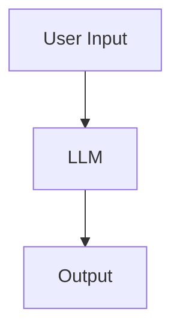
```mermaid
flowchart TD
  U["User Input"] --> L["LLM"] --> O["Output"]
```

### 3.2 Structured Output + Validator（结构化输出 + 校验器）

**概念**：让模型输出满足 Schema（JSON/Typed dict），用校验器解析；失败则自动重试/修复。  
**解决的问题**：把“不可控文本”变成“可控数据”，降低下游解析/分支复杂度。  

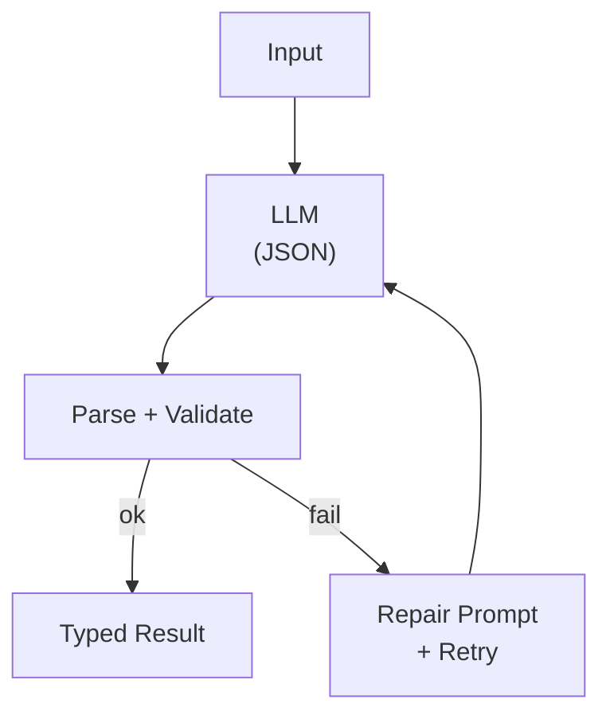
```mermaid
flowchart TD
  U["Input"] --> L["LLM\n(JSON)"] --> P["Parse + Validate"]
  P -->|ok| O["Typed Result"]
  P -->|fail| R["Repair Prompt\n+ Retry"] --> L
```

### 3.3 Tool Calling（工具/函数调用）

**概念**：模型决定是否调用工具（API/代码/检索/DB），并使用工具返回结果完成任务。  
**解决的问题**：突破纯语言的局限（获取新信息、执行动作、计算/检索/写文件）。  

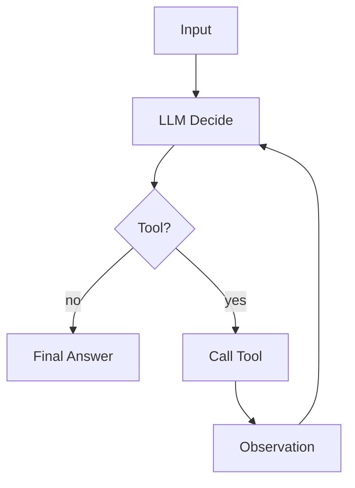
```mermaid
flowchart TD
  U["Input"] --> L["LLM Decide"] --> D{"Tool?"}
  D -->|no| O["Final Answer"]
  D -->|yes| T["Call Tool"] --> Obs["Observation"] --> L
```

---

## 4. Workflow 编排模式（稳定优先）

### 4.1 Prompt Chaining（串行流水线）

**概念**：把任务拆成固定步骤（提取→计划→写作→润色），每步都有明确输入输出。  
**解决的问题**：可控、易测试、易定位错误；适合大多数“可预先分解”的任务。  

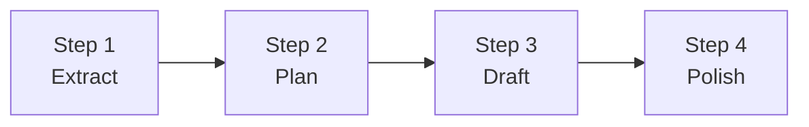
```mermaid
flowchart LR
  S1["Step 1\nExtract"] --> S2["Step 2\nPlan"] --> S3["Step 3\nDraft"] --> S4["Step 4\nPolish"]
```

### 4.2 Routing（语义路由）

**概念**：先分类/打标签，再选择最合适的 prompt / 子流程 / 模型 / 工具集合。  
**解决的问题**：输入分布很杂时，避免“一把梭 prompt”导致质量不稳定。  

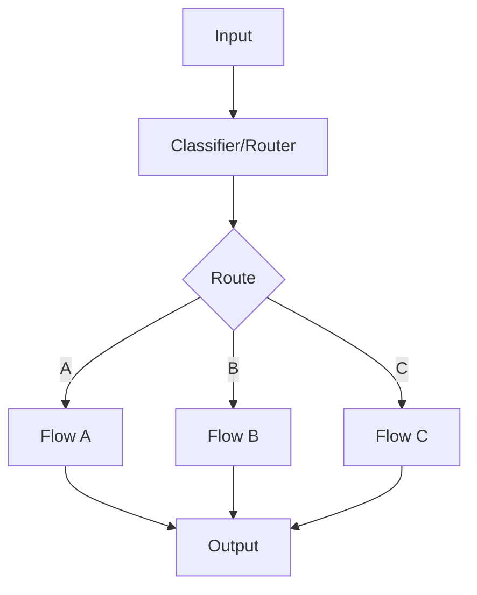
```mermaid
flowchart TD
  U["Input"] --> C["Classifier/Router"] --> R{"Route"}
  R -->|A| FA["Flow A"]
  R -->|B| FB["Flow B"]
  R -->|C| FC["Flow C"]
  FA --> O["Output"]
  FB --> O
  FC --> O
```

### 4.3 Parallel / Fan-out Fan-in（并行汇聚）

**概念**：把子任务并行跑（多段检索/多份草稿/多视角分析），再汇总。  
**解决的问题**：提升覆盖率与速度；降低单一路径失败风险。  

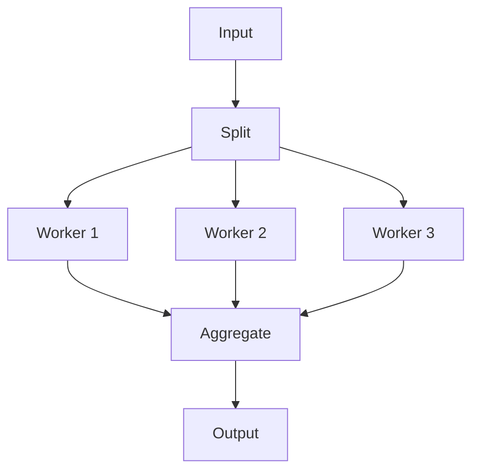
```mermaid
flowchart TD
  U["Input"] --> Split["Split"]
  Split --> W1["Worker 1"]
  Split --> W2["Worker 2"]
  Split --> W3["Worker 3"]
  W1 --> Join["Aggregate"]
  W2 --> Join
  W3 --> Join
  Join --> O["Output"]
```

### 4.4 Map-Reduce（大规模聚合）

**概念**：Map 对“很多片段”逐个处理（摘要/抽取），Reduce 再全局合并。  
**解决的问题**：长文/多文档场景下控制上下文长度，且能渐进式汇总。  

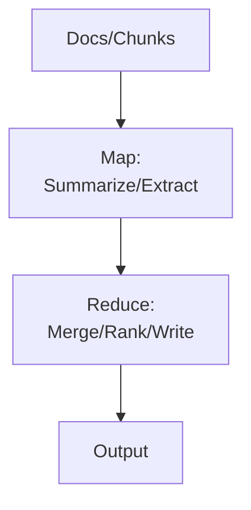
```mermaid
flowchart TD
  D["Docs/Chunks"] --> M["Map:\nSummarize/Extract"]
  M --> R["Reduce:\nMerge/Rank/Write"]
  R --> O["Output"]
```

### 4.5 Voting / Self-Consistency（多样本投票）

**概念**：对同一问题采样多次（或多模型/多 agent），再投票/聚合选更稳的答案。  
**解决的问题**：降低随机性；在推理题/难题上提升正确率。  

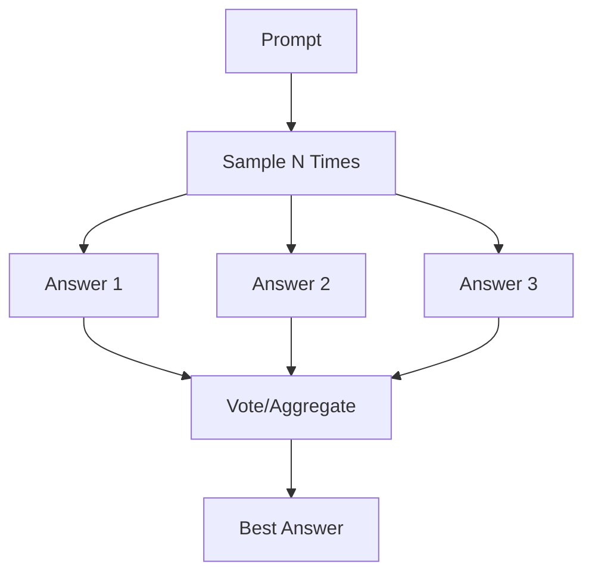
```mermaid
flowchart TD
  U["Prompt"] --> S["Sample N Times"]
  S --> A1["Answer 1"]
  S --> A2["Answer 2"]
  S --> A3["Answer 3"]
  A1 --> V["Vote/Aggregate"]
  A2 --> V
  A3 --> V
  V --> O["Best Answer"]
```

### 4.6 Evaluator-Optimizer / Maker-Checker（评审-改写闭环）

**概念**：生成器先产出，评审器按准则打分/提修改点，再迭代改写。  
**解决的问题**：把“质量标准”显式化，适合写作/代码/结构化输出的质量提升。  

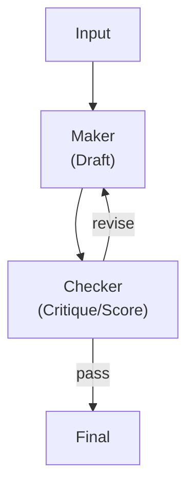
```mermaid
flowchart TD
  U["Input"] --> M["Maker\n(Draft)"] --> C["Checker\n(Critique/Score)"]
  C -->|pass| O["Final"]
  C -->|revise| M
```

### 4.7 Verification Workflow（验证工作流：规则/工具校验）

**概念**：把“正确性/合规性”交给外部验证器（规则、执行器、单测、引用检查）。  
**解决的问题**：减少幻觉；把关键断言变成可验证事实。  

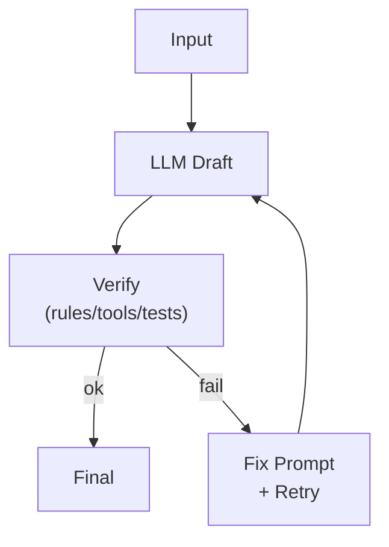
```mermaid
flowchart TD
  U["Input"] --> L["LLM Draft"] --> V["Verify\n(rules/tools/tests)"]
  V -->|ok| O["Final"]
  V -->|fail| F["Fix Prompt\n+ Retry"] --> L
```

### 4.8 Handoff / Triage（分诊/交接）

**概念**：根据任务类型把控制权交给“更合适的专家 agent/流程”。  
**解决的问题**：一个 agent 不可能擅长所有事；交接能提升专业性与可维护性。  

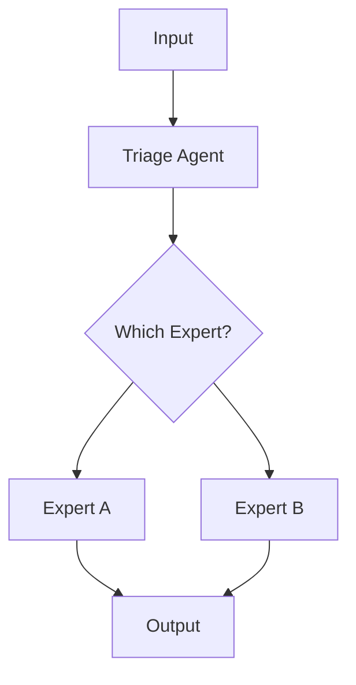
```mermaid
flowchart TD
  U["Input"] --> T["Triage Agent"] --> D{"Which Expert?"}
  D --> E1["Expert A"]
  D --> E2["Expert B"]
  E1 --> O["Output"]
  E2 --> O
```

---

## 5. Agent Loop 与状态模式（灵活但要可控）

### 5.1 Agent Loop（Reason-Act-Observe）

**概念**：模型在循环中决定下一步（回答/调用工具/改写/交接），直到完成或触发终止条件。  
**解决的问题**：当步骤无法预先写死（探索性任务、动态工具交互）时保持灵活性。  

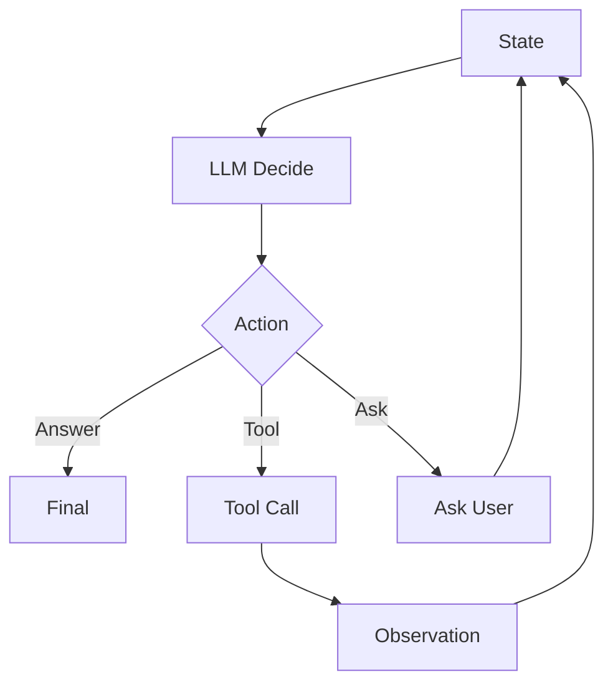
```mermaid
flowchart TD
  S["State"] --> L["LLM Decide"] --> A{"Action"}
  A -->|Answer| O["Final"]
  A -->|Tool| T["Tool Call"] --> Obs["Observation"] --> S
  A -->|Ask| Q["Ask User"] --> S
```

### 5.2 FSM / StateGraph（显式状态机/图）

**概念**：把 loop 拆成一组显式状态（route、tool、write、verify…）和转移条件。  
**解决的问题**：让 agent 可测、可回放、可插桩；降低“无限自由”带来的不可控。  

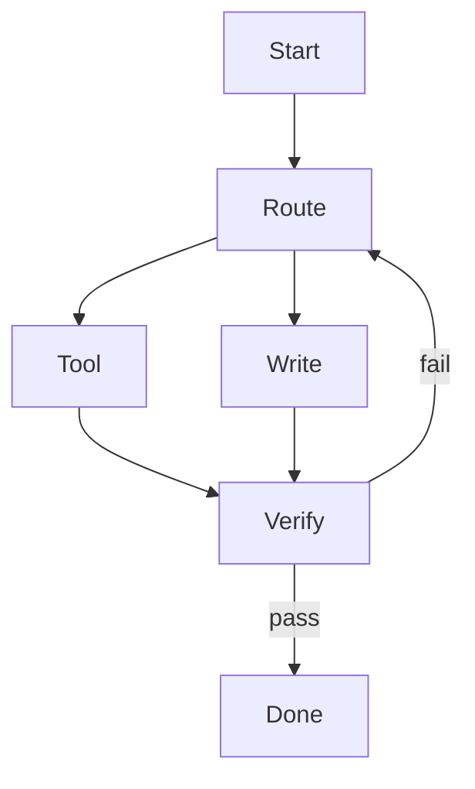
```mermaid
flowchart TD
  Start["Start"] --> Route["Route"]
  Route --> Tool["Tool"]
  Route --> Write["Write"]
  Tool --> Verify["Verify"]
  Write --> Verify
  Verify -->|pass| Done["Done"]
  Verify -->|fail| Route
```

### 5.3 Task Ledger / Blackboard（任务账本/黑板）

**概念**：用结构化“账本”记录：目标、子任务、证据、未决问题、失败原因、下一步建议。  
**解决的问题**：长任务防迷失；支持中断恢复；多 agent 协作共享进度。  

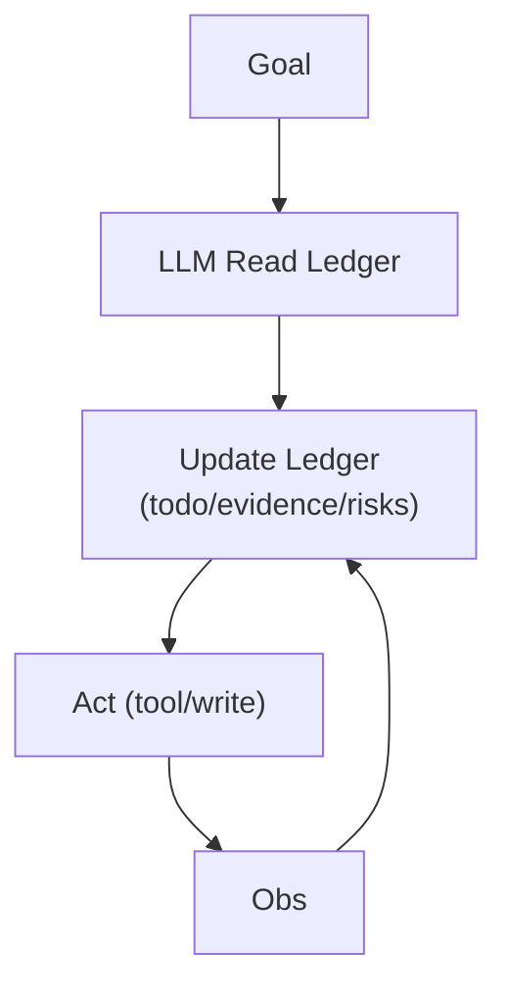
```mermaid
flowchart TD
  U["Goal"] --> L["LLM Read Ledger"]
  L --> Upd["Update Ledger\n(todo/evidence/risks)"]
  Upd --> Act["Act (tool/write)"]
  Act --> Obs["Obs"] --> Upd
```

---

## 6. 规划与分解模式（Plan / Execute / Replan）

### 6.1 Plan & Solve（先计划后求解）

**概念**：先产出计划（步骤列表/结构），再按计划执行写作或求解。  
**解决的问题**：减少走偏；提升长任务结构性；让过程更可解释。  

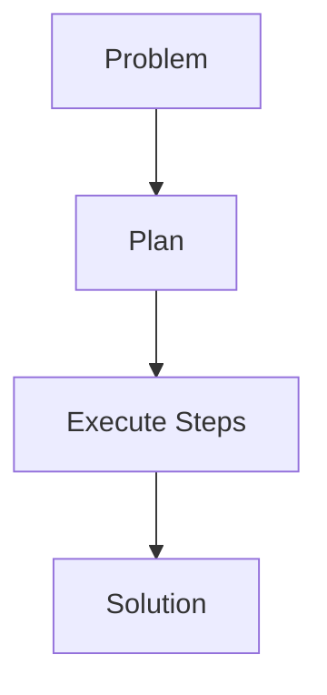
```mermaid
flowchart TD
  U["Problem"] --> P["Plan"] --> X["Execute Steps"] --> O["Solution"]
```

### 6.2 Planner-Executor-Replanner（计划-执行-再计划）

**概念**：执行中遇到新证据/失败/预算变化时触发 replan，保持计划与现实一致。  
**解决的问题**：纯“先计划”在动态环境易失效；replan 让 agent 更鲁棒。  

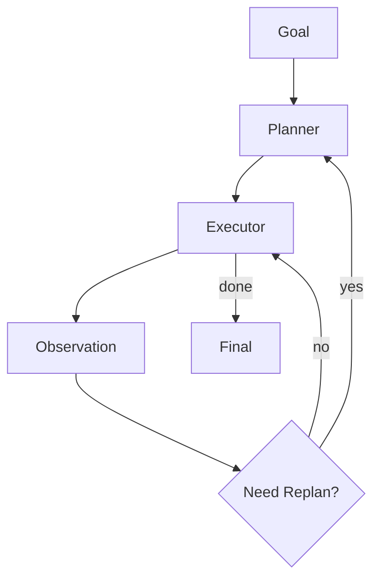
```mermaid
flowchart TD
  U["Goal"] --> P["Planner"] --> E["Executor"] --> Obs["Observation"]
  Obs --> D{"Need Replan?"}
  D -->|no| E
  D -->|yes| P
  E -->|done| O["Final"]
```

### 6.3 LLM Compiler（计划编译为可执行 DAG）

**概念**：把自然语言计划“编译”为可执行的任务图（DAG），支持并行与依赖管理。  
**解决的问题**：当步骤之间存在依赖且可并行时，提升吞吐并让执行更确定。  

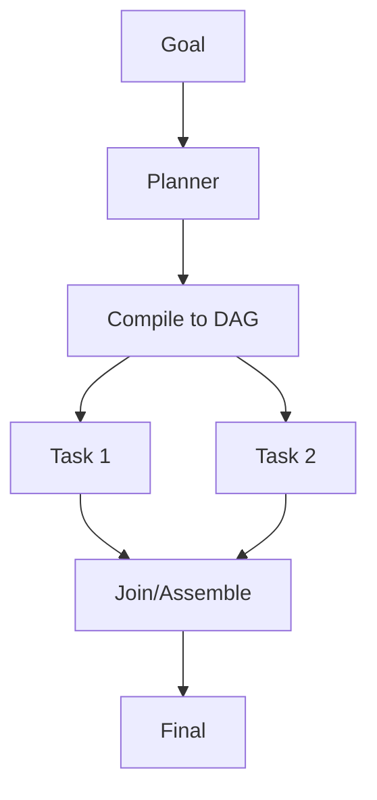
```mermaid
flowchart TD
  U["Goal"] --> P["Planner"] --> C["Compile to DAG"]
  C --> T1["Task 1"]
  C --> T2["Task 2"]
  T1 --> J["Join/Assemble"]
  T2 --> J
  J --> O["Final"]
```

### 6.4 REWOO（Reasoning Without Observation）

**概念**：把“要查哪些信息/调用哪些工具”尽量一次性规划出来，再批量执行工具，最后统一写答案。  
**解决的问题**：减少多轮工具调用往返；在工具昂贵/慢/有配额时更划算。  

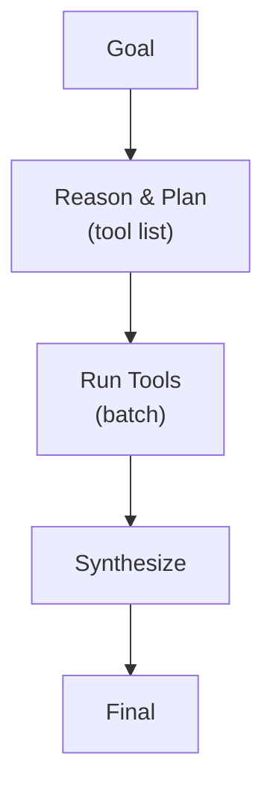
```mermaid
flowchart TD
  U["Goal"] --> R["Reason & Plan\n(tool list)"] --> T["Run Tools\n(batch)"]
  T --> S["Synthesize"] --> O["Final"]
```

---

## 7. 多智能体编排模式（规模化与专业化）

### 7.1 Orchestrator-Workers / Manager-Worker（主管-工人）

**概念**：主管负责分解与派工；工人各自完成子任务；主管汇总与整合。  
**解决的问题**：让系统可扩展、职责清晰；适合复杂项目型任务。  

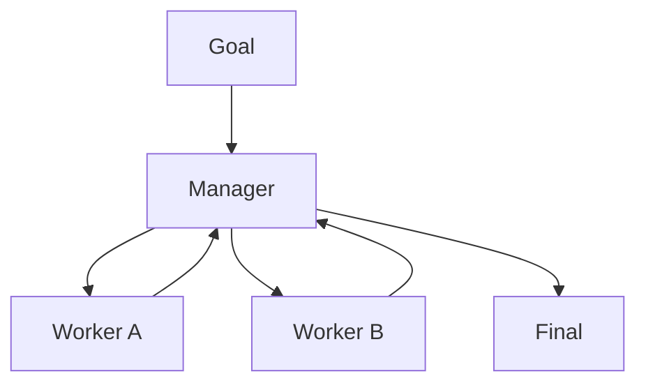
```mermaid
flowchart TD
  U["Goal"] --> M["Manager"]
  M --> W1["Worker A"]
  M --> W2["Worker B"]
  W1 --> M
  W2 --> M
  M --> O["Final"]
```

### 7.2 Group Chat / Council / Debate（圆桌协作/辩论）

**概念**：多个 agent 在共享上下文中轮流发言，靠“发言者选择策略”推动收敛。  
**解决的问题**：多视角覆盖；用对抗式审查发现漏洞；但成本更高。  

```mermaid
flowchart TD
  U["Question"] --> S["Speaker Selector"]
  S --> A["Agent A"]
  S --> B["Agent B"]
  S --> C["Agent C"]
  A --> S
  B --> S
  C --> S
  S -->|converged| O["Consensus/Answer"]
```

### 7.3 Agents-as-Tools（把子 Agent 当“工具”调用）

**概念**：主 agent 不交接控制权，只把专家 agent 当作“可调用工具”（输入→输出）。  
**解决的问题**：保留单一主线控制流，同时复用专家能力；便于做审计与权限控制。  

```mermaid
flowchart TD
  U["Goal"] --> P["Primary Agent"]
  P -->|call| E1["Expert Agent (as Tool)"]
  P -->|call| E2["Expert Agent (as Tool)"]
  E1 --> P
  E2 --> P
  P --> O["Final"]
```

### 7.4 Handoff（任务交接 / 升级）

**概念**：当当前 agent 不适合继续处理时，把任务“交接”给更合适的 agent（通常会附带一段结构化 summary / context）。  
**解决的问题**：能力边界清晰；支持“分诊/升级”；降低错误归因（哪个 agent 接手、为何接手可追踪）。  

```mermaid
flowchart TD
  U["User Task"] --> R["Router / Triage"]
  R -->|handle| A0["Current Agent"]
  R -->|handoff + summary| A1["Specialist Agent"]
  A0 --> O["Answer"]
  A1 --> O
```

### 7.5 Magentic Orchestration（任务账本驱动的动态编排）

**概念**：用 task ledger 驱动：动态选择下一步/下一位 agent；检测停滞（stall）并自动重规划。  
**解决的问题**：比“固定 manager-worker”更适合开放域任务；把“何时换人/何时改计划”系统化。  

```mermaid
flowchart TD
  L["Task Ledger"] --> Sel["Select Next Action/Agent"]
  Sel --> A1["Agent/Worker"]
  A1 --> Upd["Update Ledger\n(progress/evidence)"] --> L
  Upd --> St{"Stalled?"}
  St -->|no| Sel
  St -->|yes| R["Replan / Strategy Shift"] --> Sel
```

### 7.6 Hierarchical Process（层级流程：多层 manager）

**概念**：多层级委派（总监→经理→工人），逐级细化任务与验收。  
**解决的问题**：当任务需要强拆分与多团队协作时，层级结构更贴近组织形态。  

```mermaid
flowchart TD
  U["Goal"] --> D1["Director"]
  D1 --> M1["Manager 1"]
  D1 --> M2["Manager 2"]
  M1 --> W1["Workers"]
  M2 --> W2["Workers"]
  W1 --> M1 --> D1
  W2 --> M2 --> D1
  D1 --> O["Final"]
```

### 7.7 Swarm / Peer-to-Peer（去中心协作，可选）

**概念**：没有固定主管，agent 之间以协议协商分工与合并。  
**解决的问题**：探索性强、组织松散的场景；但更难控、更难调试。  

```mermaid
flowchart TD
  U["Goal"] --> A["Agent A"]
  U --> B["Agent B"]
  U --> C["Agent C"]
  A <--> B
  B <--> C
  C <--> A
  A --> O["Merged Output"]
  B --> O
  C --> O
```

---

## 8. 检索与研究写作模式（RAG 及其升级）

### 8.1 Retrieval Loop（检索→阅读→改 Query→再检索）

**概念**：把检索做成循环：初次查询→读结果→发现缺口→改写 query→补证据→回答。  
**解决的问题**：一次检索不够时提升召回；减少“漏关键资料”的概率。  

```mermaid
flowchart TD
  Q["Question"] --> S["Search"] --> R["Read Results"]
  R --> G{"Gap?"}
  G -->|yes| Q2["Refine Query"] --> S
  G -->|no| O["Answer w/ Evidence"]
```

### 8.2 Agentic RAG（Agentic Retrieval / RAG Agent）

**概念**：把 RAG 做成 **agent loop**：模型动态决定 **何时检索、检索什么、是否改 query、是否再检索、何时停止并写答案**；常配合 `ledger/evidence` 做证据管理。  
**解决的问题**：传统“一次检索→一次生成”在复杂问题下容易证据不足或漏检；Agentic RAG 通过“迭代补证据 + 终止条件”提升覆盖与可控性。  

```mermaid
flowchart TD
  Q["Question"] --> P["Decide next step\n(route/plan)"]
  P --> D{"Need retrieval?"}
  D -->|no| A["Answer"]
  D -->|yes| R["Retrieve\n(search/vector/graph)"]
  R --> E["Extract Evidence\n+ Update Ledger"]
  E --> G{"Evidence sufficient?"}
  G -->|no| P
  G -->|yes| V["Verify claims/citations\n(optional)"] --> A
```

### 8.3 Classic RAG（一次检索→一次生成）

**概念**：把检索与生成编进工具调用；可结合验证、引用、去重、摘要。  
**解决的问题**：用外部知识降低幻觉；对私域知识/长文档更有效。  

```mermaid
flowchart TD
  U["Question"] --> L["LLM Decide"] --> T["Retrieve"]
  T --> C["Context Pack\n(chunks)"] --> W["Write Answer"] --> O["Final"]
```

### 8.4 GraphRAG（图结构 RAG：Global + Local）

**概念**：把语料组织为图/社区摘要；用全局搜索回答“宏观问题”，用局部搜索补细节。  
**解决的问题**：传统 RAG 对“全局概念/跨文档关联”弱；GraphRAG 强在全局结构化总结。  

```mermaid
flowchart TD
  U["Question"] --> D{"Global or Local?"}
  D -->|Global| G["Global Search\n(communities)"] --> S1["Synthesize Overview"]
  D -->|Local| L["Local Search\n(entities/edges)"] --> S2["Synthesize Details"]
  S1 --> O["Answer"]
  S2 --> O
```

### 8.5 DRIFT（Global+Local 的漂移搜索）

**概念**：先用 global 抓主线，再“漂移”到相关局部子图做深挖，融合两者。  
**解决的问题**：只 global 会泛、只 local 会碎；DRIFT 折中提升质量与效率。  

```mermaid
flowchart TD
  U["Question"] --> G["Global Search\n(seed topics)"] --> D["Drift to Local\n(expand)"]
  D --> L["Local Retrieval"] --> S["Synthesize"] --> O["Answer"]
```

### 8.6 STORM（研究写作：从问题到长文）

**概念**：把“研究+写作”拆成：提出子问题→检索→写段落→迭代补证据→成文。  
**解决的问题**：长文写作需要证据与结构；STORM 强调“边研究边写”。  

```mermaid
flowchart TD
  U["Topic"] --> O1["Outline"] --> Q["Generate Questions"]
  Q --> S["Search"] --> N["Take Notes"] --> W["Write Section"]
  W --> C{"More Gaps?"}
  C -->|yes| Q
  C -->|no| Done["Full Article"]
```

---

## 9. 记忆模式（让 agent 变“可持续”）

### 9.1 Conversation Summary Memory（对话摘要记忆）

**概念**：把历史对话压缩成摘要，减少上下文占用。  
**解决的问题**：长对话不爆上下文；保留关键约束与偏好。  

```mermaid
flowchart TD
  H["Chat History"] --> S["Summarize"] --> M["Summary Memory"]
  M --> L["Next Turn Prompt"]
```

### 9.2 Episodic / KV Memory（事件/键值记忆）

**概念**：显式记录“事实/偏好/决定”（key-value 或事件流），按策略读写。  
**解决的问题**：减少信息丢失；让系统可控地“记住该记的”。  

```mermaid
flowchart TD
  Obs["Observation"] --> W["Write Policy"] --> KV["KV Store"]
  U["New Task"] --> R["Read Policy"] --> KV --> L["LLM Context"]
```

### 9.3 Vector Memory（向量记忆/语义回忆）

**概念**：把片段嵌入向量空间，用相似度召回相关记忆。  
**解决的问题**：当 key 不明确或记忆量很大时，语义检索更好用。  

```mermaid
flowchart TD
  M["Memory Items"] --> E["Embed"] --> V["Vector DB"]
  Q["Query"] --> EQ["Embed Query"] --> V --> R["Top-K Recall"] --> L["LLM"]
```

### 9.4 Session Memory（会话级持久状态）

**概念**：把一次运行的状态（ledger、缓存、历史、审批点）持久化，可中断恢复。  
**解决的问题**：长任务/线上服务需要可恢复性与审计。  

```mermaid
flowchart TD
  Run["Run State"] --> P["Persist\n(SQLite/Redis)"]
  P --> R["Resume"] --> Run
```

---

## 10. 验证与可靠性模式（把“正确/稳”系统化）

### 10.1 Chain-of-Verification（CoVe，验证链）

**概念**：先产出回答，再生成“需要核对的断言清单”，逐条验证并修正。  
**解决的问题**：减少幻觉与自信错误；尤其适合事实型回答与带引用的报告。  

```mermaid
flowchart TD
  U["Question"] --> D["Draft Answer"]
  D --> C["Claim List"]
  C --> V["Verify Claims\n(search/tools)"]
  V --> F["Fix Answer"] --> O["Final"]
```

### 10.2 Tool-based Verification（执行/单测/约束校验）

**概念**：用“可执行的验证器”取代纯语言自检（跑单测、执行代码、lint、schema 校验）。  
**解决的问题**：语言自检不可靠；工具校验更接近地面真相。  

```mermaid
flowchart TD
  A["Proposed Output"] --> T["Run Verifier\n(tests/exec/rules)"]
  T -->|pass| O["Accept"]
  T -->|fail| F["Patch/Retry"] --> A
```

### 10.3 Retry + Backoff（重试退避）

**概念**：对可恢复错误（超时/限流/临时失败）做带退避的重试。  
**解决的问题**：线上波动不可避免；重试提升成功率但要防雪崩。  

```mermaid
flowchart TD
  X["Call"] --> R{"Error?"}
  R -->|no| O["Success"]
  R -->|yes| B["Backoff\n+ Retry"] --> X
```

### 10.4 Fallback Chain（降级链）

**概念**：主路径失败时按优先级降级（换模型/换工具/换策略/改写目标）。  
**解决的问题**：提升可用性；把“失败”变成“可接受的次优结果”。  

```mermaid
flowchart TD
  P["Primary"] --> D{"OK?"}
  D -->|yes| O["Result"]
  D -->|no| F1["Fallback 1"] --> D2{"OK?"}
  D2 -->|yes| O
  D2 -->|no| F2["Fallback 2"] --> O
```

### 10.5 Circuit Breaker（熔断）

**概念**：当某依赖持续失败时短期直接拒绝/走降级，避免反复打爆下游。  
**解决的问题**：保护系统稳定性，防止级联失败。  

```mermaid
flowchart TD
  Call["Call Dependency"] --> S{"Breaker State"}
  S -->|closed| Try["Try"] --> R{"Fail Rate High?"}
  R -->|no| O["OK"]
  R -->|yes| Open["Open Breaker"]
  S -->|open| Fast["Fail Fast\nor Fallback"] --> O2["Degraded"]
```

### 10.6 Caching（缓存：确定性/语义）

**概念**：对工具结果/模型结果做缓存（key 精确匹配或语义近似），减少重复成本。  
**解决的问题**：降低延迟与费用；在多轮 loop 中尤其重要。  

```mermaid
flowchart TD
  Q["Request"] --> K["Cache Key"] --> C{"Hit?"}
  C -->|yes| O["Return Cached"]
  C -->|no| Run["Run Tool/LLM"] --> Store["Store"] --> O2["Return"]
```

---

## 11. 安全与治理模式（可控、可审计、可上线）

### 11.1 Guardrails（输入/输出/工具级护栏 + Tripwire）

**概念**：在输入、输出、工具调用前后挂上护栏；触发 tripwire 则中止/升级/改写。  
**解决的问题**：把安全、合规、质量门槛做成“系统能力”，而不是靠 prompt 运气。  

```mermaid
flowchart TD
  U["Input"] --> GI["Input Guardrail"]
  GI -->|ok| L["LLM/Flow"]
  GI -->|tripwire| Stop1["Block/Escalate"]
  L --> GO["Output Guardrail"]
  GO -->|ok| O["Final"]
  GO -->|tripwire| Stop2["Block/Escalate"]
```

### 11.2 Tool Policies / Allowlist（工具白名单与权限边界）

**概念**：用策略限制 agent 能用哪些工具、哪些参数范围、哪些资源路径。  
**解决的问题**：防越权与注入；把“能做什么”从 prompt 中抽离出来。  

```mermaid
flowchart TD
  L["LLM Proposed Tool Call"] --> P["Policy Check"]
  P -->|allow| T["Execute Tool"] --> O["Observation"]
  P -->|deny| F["Refuse/Ask Human"] --> L
```

### 11.3 Human-in-the-Loop Approvals（人类审批：暂停-恢复）

**概念**：高风险操作（发邮件、转账、写生产数据、删除文件）必须人工批准；批准后从同一状态继续跑。  
**解决的问题**：把“最后一道闸门”系统化，降低线上事故概率。  

```mermaid
flowchart TD
  L["Agent Proposes Action"] --> A{"Needs Approval?"}
  A -->|no| T["Execute"] --> O["Done"]
  A -->|yes| H["Human Review"] --> D{"Approve?"}
  D -->|yes| T
  D -->|no| R["Revise Plan"] --> L
```

### 11.4 Sandbox-first Execution（沙箱优先：隔离执行）

**概念**：把代码执行/文件操作/网络访问放进受控沙箱，限制权限与资源，并记录审计日志。  
**解决的问题**：降低外泄与破坏风险；让 agent 具备“可安全执行”的能力。  

```mermaid
flowchart TD
  L["Plan/Tool Call"] --> S["Sandbox\n(Isolated FS/Net)"]
  S --> R["Result + Audit Log"] --> L
```

### 11.5 MCP / Standardized Tool Integration（标准化工具接入）

**概念**：用统一协议/接口把外部工具接进来（工具是“可发现/可声明/可审计”的）。  
**解决的问题**：工具生态扩展时不把系统写死在某个 SDK；方便治理与复用。  

```mermaid
flowchart TD
  Agent["Agent Runtime"] --> Reg["Tool Registry\n(MCP/Adapters)"]
  Reg --> T1["Tool A"]
  Reg --> T2["Tool B"]
  T1 --> Agent
  T2 --> Agent
```

---

## 12. 可观测与评测模式（让你能调试、能迭代）

### 12.1 Tracing（全链路追踪）

**概念**：记录每次模型调用、工具调用、handoff、guardrail 事件、耗时、token、错误。  
**解决的问题**：没有 trace 的 agent 系统基本不可调试；也无法做线上监控与回归。  

```mermaid
flowchart TD
  Run["Run"] --> E1["LLM Span"]
  Run --> E2["Tool Span"]
  Run --> E3["Guardrail Span"]
  E1 --> Trace["Trace Store"]
  E2 --> Trace
  E3 --> Trace
```

### 12.2 Eval Harness（离线评测与回归）

**概念**：把任务集合、评分器（规则/模型/人工）、基线对比固化为可重复评测。  
**解决的问题**：agent 迭代很容易“改 A 坏 B”；评测是系统化的防回退手段。  

```mermaid
flowchart TD
  DS["Task Set"] --> Run["Run System"] --> Out["Outputs"]
  Out --> Sc["Scorer\n(rules/LLM/human)"] --> Rep["Report/Regression"]
```

---

## 13. 代表性的“推理/研究”Agent 模式（常见于公开 pattern 集）

> 这些更偏“推理策略/搜索策略”，常作为 Agent Loop 或 Workflow 的内部子模块。

### 13.1 ReAct（Reason + Act）

**概念**：模型交替进行推理与行动（工具调用），根据观察再继续推理。  
**解决的问题**：把“思考”与“获取证据/执行动作”交织起来，适合工具增强任务。  

```mermaid
flowchart TD
  U["Question"] --> R["Reason"] --> A{"Act?"}
  A -->|tool| T["Tool"] --> O1["Obs"] --> R
  A -->|answer| O["Final"]
```

### 13.2 Reflection（自我反思/自我批改）

**概念**：先给出草稿，再以“评审者视角”找问题并修订。  
**解决的问题**：提升输出质量与一致性；对写作与代码尤为常用。  

```mermaid
flowchart TD
  U["Input"] --> D["Draft"]
  D --> R["Reflect/Critique"] --> F["Fix"] --> O["Final"]
```

### 13.3 Reflexion（带记忆的反思：从错误中学习）

**概念**：把失败案例与改进建议写入记忆；下次遇到类似任务先读取“教训”。  
**解决的问题**：减少重复犯错；让系统跨任务改进。  

```mermaid
flowchart TD
  Run["Attempt"] --> V["Verify"] --> D{"Success?"}
  D -->|yes| O["Done"]
  D -->|no| M["Write Lesson\n(to memory)"] --> Run
```

### 13.4 LATS（Language Agent Tree Search）

**概念**：把 agent 的行动序列当作搜索树；展开多个候选行动路径，用评估器选更优分支。  
**解决的问题**：单一路径容易走偏；树搜索提升探索与最优性（代价是更贵）。  

```mermaid
flowchart TD
  S["State"] --> Exp["Expand\n(k actions)"] --> Eval["Evaluate\n(score)"]
  Eval --> Sel["Select Best\n(branch)"] --> S
  Sel -->|terminal| O["Final"]
```

### 13.5 Self-Discovery（自发现：选择推理模块/策略）

**概念**：先“选策略/模块”（例如：分解、类比、验证、反例），再按选定策略执行。  
**解决的问题**：不同题型需要不同思考方式；让策略选择显式化。  

```mermaid
flowchart TD
  U["Task"] --> S["Select Reasoning Modules"]
  S --> A["Apply Modules\n(step-by-step)"] --> O["Answer"]
```

### 13.6 Mixture-of-Agents（MoA：分层集成/聚合）

**概念**：多个 proposer（模型/agent）先各自给候选，再由 aggregator 统一综合。  
**解决的问题**：用“集成”提升鲁棒性与质量；在写作/推理/方案设计中常见。  

```mermaid
flowchart TD
  U["Prompt"] --> P["Proposers"]
  P --> A1["Candidate 1"]
  P --> A2["Candidate 2"]
  P --> A3["Candidate 3"]
  A1 --> Agg["Aggregator\n(synthesize)"]
  A2 --> Agg
  A3 --> Agg
  Agg --> O["Final"]
```

---

## 14. 推荐实现顺序（把“大而全”拆成可落地里程碑）

> 目标是：先做“可运行、可测、可观测”的最小系统，再逐步加模式。

1) **最小 Runtime**：Model 接口、Tool 接口、Structured Output + Validator、Trace 记录  
2) **Workflow 基建**：Prompt Chaining、Routing、Parallel/Map-Reduce、Evaluator-Optimizer  
3) **Agent 核心**：Agent Loop + Budget/MaxSteps + Tool Policies + Ledger  
4) **规划能力**：Plan&Solve、Planner-Executor-Replanner、REWOO、LLM Compiler（可选）  
5) **检索研究**：Retrieval Loop、RAG Agent、STORM；再上 GraphRAG/DRIFT（可选）  
6) **多 Agent**：Manager-Worker、Agents-as-Tools、Handoff、Group Chat、Magentic（可选）  
7) **生产化**：Guardrails、HITL 审批、Sandbox、Caching、熔断、Eval Harness

---

## 15. 下一步（把大纲变成可运行参考实现）

如果你确认这份目录与覆盖范围 OK，下一步就可以开始落地一个 Python repo：

- `src/runtime/`：最小 agent runtime（state、ledger、tracing、policies）
- `src/patterns/`：每个 pattern 的最小实现（独立可组合）
- `examples/`：每个 pattern 一个离线可跑 demo（默认 `MockLLM`）
- `tests/`：关键模式的回归测试（`unittest`）
