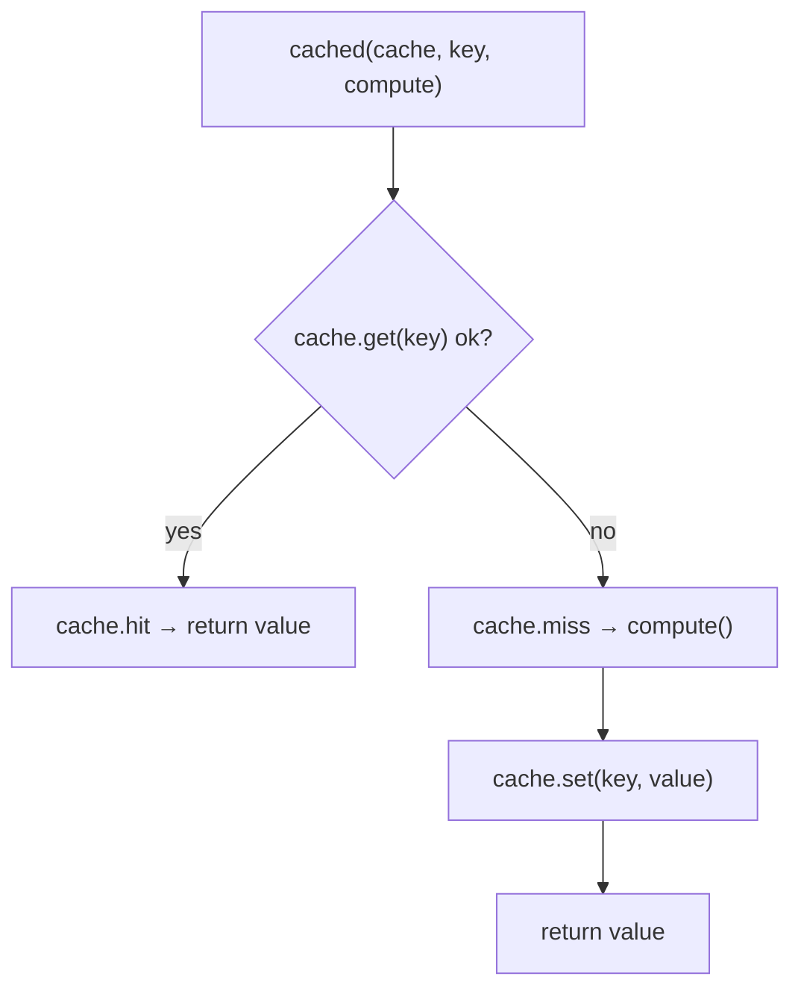

# Cache (Determinism and Cost Control)

## What Problem It Solves

In agent systems, you often re-run the *same* expensive thing:

- the same tool call during a loop
- the same prompt during debugging
- the same eval suite during regression checks

Caching helps you:

- cut latency and cost
- make runs more deterministic (especially in evals)
- avoid burning tokens on “I already did this”

## How It Works (in This Repo)

This repo keeps caching dead simple:

- `InMemoryCache[T]`: a dict of `key -> CacheEntry(value, expires_at?)`
- `cached(...)`: “get-or-compute” wrapper with optional `ttl_s`
- Trace events: `cache.hit`, `cache.miss`, `cache.set` (if a `Tracer` is provided)



## When to Use / When NOT to Use

Use it when the operation is **idempotent** and the output is “close enough” to reuse:

- deterministic tools (parsers, pure functions, local search over static corpus)
- flaky upstream calls where retries are expensive
- evaluation runs (stability beats freshness)

Avoid it for:

- side-effectful operations (sending emails, charging cards, writing files)
- time-sensitive queries (prices, news, “today’s” anything) unless TTL is tight
- anything where stale answers are worse than slow answers

## Worked Example

```python
from agent_patterns_lab.runtime import InMemoryCache, Tracer, cached

cache = InMemoryCache[str]()
tracer = Tracer()

def expensive() -> str:
    return "hello"

v1 = cached(cache, key="k:demo", compute=expensive, ttl_s=60, tracer=tracer)  # miss + set
v2 = cached(cache, key="k:demo", compute=expensive, ttl_s=60, tracer=tracer)  # hit

assert v1 == v2 == "hello"
tracer.export_jsonl(".traces/cache-demo.jsonl")
```

## Failure Modes & Mitigations

- **Key collisions** → include the *real* inputs in the key (tool name + args hash, prompt hash, etc.).
- **Stale results** → use `ttl_s`, or include a version/timestamp in the key.
- **Unbounded growth** → add eviction policy (LRU) or periodic clears (not implemented here).
- **Caching bad outputs** (hallucinations, tool errors) → only cache post-validated results, or cache by status.

## Repo Reference

- Implementation: [`src/agent_patterns_lab/runtime/cache.py`](https://github.com/lifeodyssey/agent-patterns-lab/blob/main/src/agent_patterns_lab/runtime/cache.py)
- Tests: [`tests/test_cache.py`](https://github.com/lifeodyssey/agent-patterns-lab/blob/main/tests/test_cache.py)
