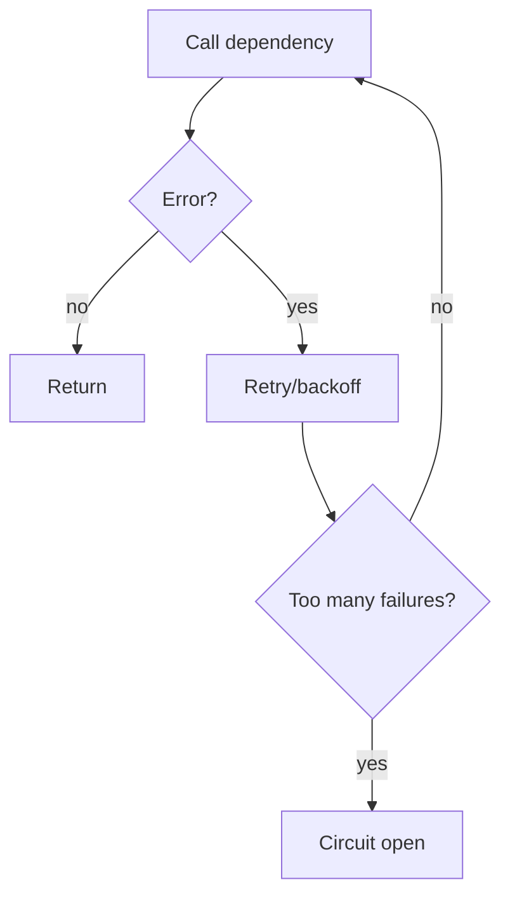

# Reliability Primitives (Retry / Fallback / Circuit Breaker)

## What Problem It Solves

Real systems fail:

- transient errors (timeouts, rate limits)
- flaky tools
- upstream outages

Reliability primitives are cross-cutting “safety rails”.

## How It Works (in This Repo)

This repo implements three minimal wrappers:

- `retry(fn, attempts, backoff_s, ...)`
- `fallback_chain([fn1, fn2, ...])`
- `CircuitBreaker.call(fn)`

They’re small on purpose. The value is not cleverness; it’s having a *standard place* to handle failure and emit traces.

## Primitives

- **Retry**: try again with backoff.
- **Fallback chain**: try alternative strategies/providers.
- **Circuit breaker**: stop calling a failing dependency for a while.



## When to Use / When NOT to Use

Use them for:

- networked dependencies (LLM APIs, remote tools)
- flaky tools you can safely retry
- production flows where “just crash” is unacceptable

Don’t blindly retry:

- non-idempotent side effects (payments, emails, writes) unless you have dedupe keys
- permanent errors (bad request, auth) — you’ll just amplify cost and noise

## Worked Example

```python
from agent_patterns_lab.runtime import CircuitBreaker, Tracer, fallback_chain, retry

tracer = Tracer()

# Retry: fail once, then succeed.
calls = {"n": 0}

def flaky() -> str:
    calls["n"] += 1
    if calls["n"] == 1:
        raise RuntimeError("transient")
    return "ok"

assert retry(flaky, attempts=3, backoff_s=0, tracer=tracer) == "ok"

# Fallback: primary fails, secondary works.
assert fallback_chain([lambda: (_ for _ in ()).throw(RuntimeError("down")), lambda: "ok"], tracer=tracer) == "ok"

# Circuit breaker: open after repeated failures.
cb = CircuitBreaker(failure_threshold=2, reset_timeout_s=60)
for _ in range(2):
    try:
        cb.call(lambda: (_ for _ in ()).throw(RuntimeError("boom")), tracer=tracer)
    except RuntimeError:
        pass
```

## Failure Modes & Mitigations

- **Retry storms**: add jitter + budgets; treat rate limits as a signal to back off harder.
- **Fallback hides real problems**: emit structured events, and alert when fallbacks trigger.
- **Circuit opens too aggressively**: tune thresholds per dependency; “LLM API” and “local tool” behave differently.

## Repo Reference

- Implementation: [`src/agent_patterns_lab/runtime/reliability.py`](https://github.com/lifeodyssey/agent-patterns-lab/blob/main/src/agent_patterns_lab/runtime/reliability.py)
- Tests: [`tests/test_reliability.py`](https://github.com/lifeodyssey/agent-patterns-lab/blob/main/tests/test_reliability.py)
