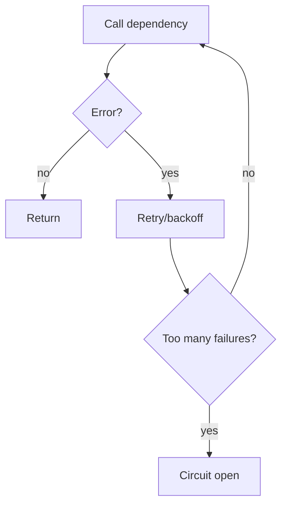

# Reliability Primitives (Retry / Fallback / Circuit Breaker)

## The Problem It Solves

Real systems fail:

- transient errors (timeouts, rate limits)
- flaky tools
- upstream outages

Reliability primitives are cross-cutting “safety rails”.

## Primitives

- **Retry**: try again with backoff.
- **Fallback chain**: try alternative strategies/providers.
- **Circuit breaker**: stop calling a failing dependency for a while.

## Repo Reference

- Implementation: `src/agent_patterns_lab/runtime/reliability.py`
- Tests: `tests/test_reliability.py`
