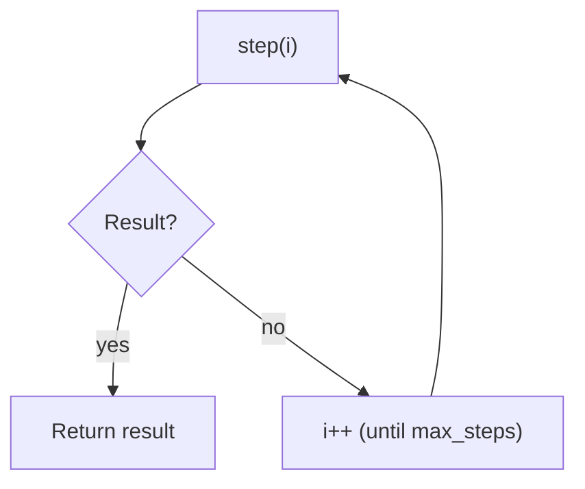

# Loop Controller (Budgeted Termination)

## What Problem It Solves

Agent loops can run forever. A loop controller provides:

- `max_steps` budget
- a single “stop when result exists” contract
- consistent trace events



## How It Works (in This Repo)

`run_loop(step_fn, limits=RunLimits(max_steps=...))` is the core:

- your `step_fn(i)` returns **a value** to stop, or `None` to continue
- the controller emits trace events: `loop.step`, `loop.done`, `loop.max_steps`
- if no value is returned within `max_steps`, it raises `MaxStepsExceeded`

That’s it. No hidden magic. The patterns build the higher-level semantics.

## When to Use / When NOT to Use

Use a loop controller anytime your agent can take multiple steps:

- ReAct tool loops
- retrieval loops
- multi-round critique / revision loops

You might not need it for fixed workflows (prompt chaining with a known number of steps).

## Worked Example

```python
from agent_patterns_lab.runtime import RunLimits, Tracer, run_loop

tracer = Tracer()

def step(i: int) -> str | None:
    if i < 2:
        return None
    return "done"

out = run_loop(step, limits=RunLimits(max_steps=5), tracer=tracer)
assert out == "done"
```

## Failure Modes & Mitigations

- **“Loops forever”**: set `max_steps` and treat `MaxStepsExceeded` as a first-class outcome.
- **No progress**: add stall detection at the pattern level (e.g., repeated actions, repeated queries).
- **Too strict budgets**: tune budgets per pattern and per task; don’t share one global default blindly.

## Repo Reference

- Implementation: [`src/agent_patterns_lab/runtime/runner.py`](https://github.com/lifeodyssey/agent-patterns-lab/blob/main/src/agent_patterns_lab/runtime/runner.py)
- Tests: [`tests/test_runner.py`](https://github.com/lifeodyssey/agent-patterns-lab/blob/main/tests/test_runner.py)
