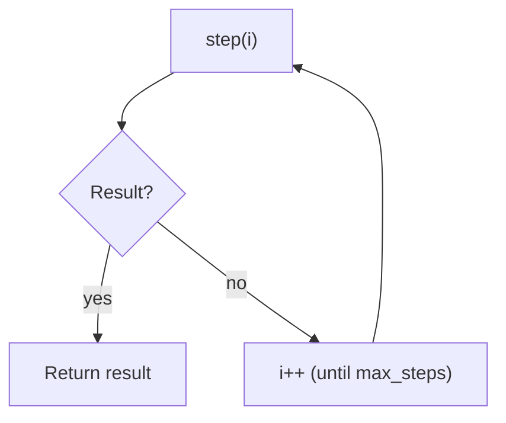

# Loop Controller (Budgeted Termination)

## The Problem It Solves

Agent loops can run forever. A loop controller provides:

- `max_steps` budget
- a single “stop when result exists” contract
- consistent trace events

## Repo Reference

- Implementation: [`src/agent_patterns_lab/runtime/runner.py`](https://github.com/lifeodyssey/agent-patterns-lab/blob/main/src/agent_patterns_lab/runtime/runner.py)
- Tests: [`tests/test_runner.py`](https://github.com/lifeodyssey/agent-patterns-lab/blob/main/tests/test_runner.py)

