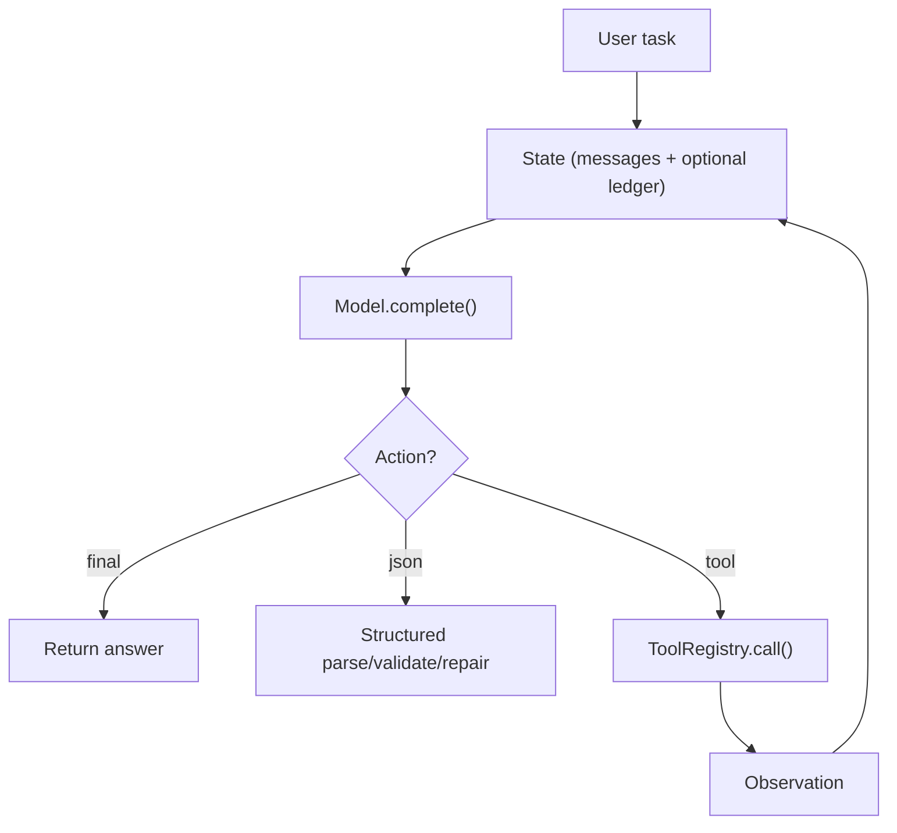

# Runtime Overview (The “Lego Bricks”)

## What Problem It Solves

If you implement each pattern as a one-off script, two things happen fast:

- you can’t compare patterns fairly (different I/O, different assumptions)
- you can’t regression-test anything (every run is a snowflake)

So this repo keeps a **minimal runtime**: a small set of reusable primitives that patterns compose. Boring on purpose. That’s the point.

## What’s In the Runtime

Most patterns are compositions of a few reusable capabilities:

1. **Messages**: a minimal chat format (`system/user/assistant/tool`).
2. **Model interface**: a single `complete(messages) -> str`.
3. **Structured output**: parse + validate JSON with repair retries.
4. **Tool calling**: register tools and call them with tracing.
5. **Loop controller**: `max_steps` budget and deterministic termination.
6. **Retrieval**: a local index for offline RAG demos/tests.
7. **Memory**: KV + session stores (offline-first).
8. **Reliability wrappers**: retry/backoff, fallback, circuit breaker.
9. **Governance**: tool policy, guardrails, HITL approval.
10. **Observability**: tracing + eval harness.

## How It Works (Conceptually)

Everything is a loop around a shared state (messages + optional ledgers):



If you only remember one thing: **patterns differ mainly in how they decide the next action and how they validate it**.

## Why a Minimal Runtime Matters

- Makes patterns **comparable** (same input/output discipline).
- Makes testing **offline and deterministic** (via `MockLLM`).
- Keeps the repo **framework-free** (no LangChain/LangGraph).

## When to Use / When NOT to Use

Use this runtime when:

- you want to compare patterns fairly (same runner/tools/tracing)
- you want offline, deterministic examples/tests (`MockLLM`)
- you want a small codebase you can audit end-to-end

Avoid over-building the runtime when:

- a one-off script will do and you won't reuse it
- you can't state the failure mode you're trying to address (add runtime pieces only when they buy you something)

## Worked Example

Run a deterministic example (no network, no API keys):

```bash
uv run python examples/21_react_loop.py
```

Then open the trace (JSONL). You can literally see each step of the travel planning agent. See [Command Notes](../run_commands.md) for command details.

## Failure Modes & Mitigations

- **Everything becomes “prompt engineering”**: keep the runtime APIs small and typed (structured output helps).
- **Tests become flaky**: default to `MockLLM` and offline tools; gate live-model runs behind extras.
- **Unbounded agent loops**: enforce `max_steps` budgets and emit trace events when you stop.

## Where It Lives in This Repo

- Types + messages: [`src/agent_patterns_lab/runtime/types.py`](https://github.com/lifeodyssey/agent-patterns-lab/blob/main/src/agent_patterns_lab/runtime/types.py)
- Model protocol + MockLLM: `src/agent_patterns_lab/runtime/model.py`, `src/agent_patterns_lab/runtime/mock_model.py`
- Structured output: [`src/agent_patterns_lab/runtime/structured.py`](https://github.com/lifeodyssey/agent-patterns-lab/blob/main/src/agent_patterns_lab/runtime/structured.py)
- Tools: [`src/agent_patterns_lab/runtime/tools.py`](https://github.com/lifeodyssey/agent-patterns-lab/blob/main/src/agent_patterns_lab/runtime/tools.py)
- Loop controller: [`src/agent_patterns_lab/runtime/runner.py`](https://github.com/lifeodyssey/agent-patterns-lab/blob/main/src/agent_patterns_lab/runtime/runner.py)
- Tracing: [`src/agent_patterns_lab/runtime/tracing.py`](https://github.com/lifeodyssey/agent-patterns-lab/blob/main/src/agent_patterns_lab/runtime/tracing.py)
- Reliability: [`src/agent_patterns_lab/runtime/reliability.py`](https://github.com/lifeodyssey/agent-patterns-lab/blob/main/src/agent_patterns_lab/runtime/reliability.py)
- Cache: [`src/agent_patterns_lab/runtime/cache.py`](https://github.com/lifeodyssey/agent-patterns-lab/blob/main/src/agent_patterns_lab/runtime/cache.py)
- Memory: [`src/agent_patterns_lab/runtime/memory/`](https://github.com/lifeodyssey/agent-patterns-lab/blob/main/src/agent_patterns_lab/runtime/memory/)
- Governance:
  - `src/agent_patterns_lab/runtime/policy.py`
  - `src/agent_patterns_lab/runtime/guardrails.py`
  - `src/agent_patterns_lab/runtime/hitl.py`
- Eval harness: [`src/agent_patterns_lab/runtime/evals/`](https://github.com/lifeodyssey/agent-patterns-lab/blob/main/src/agent_patterns_lab/runtime/evals/)
