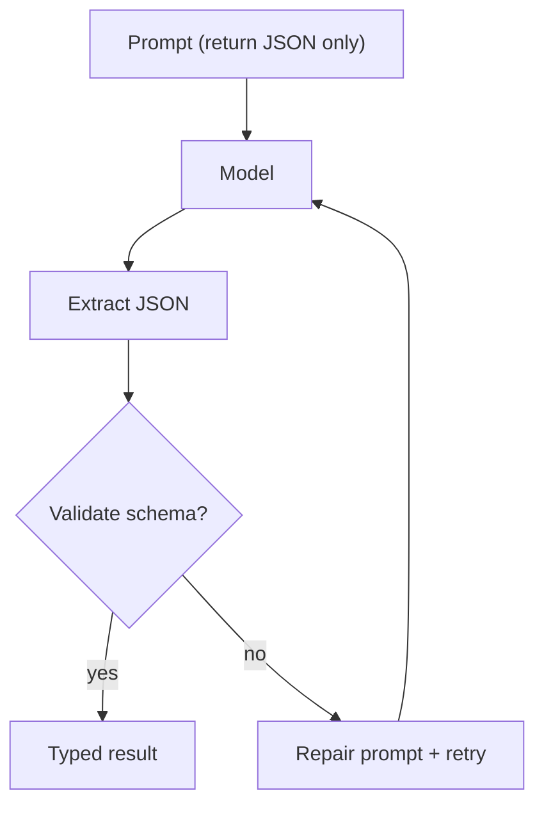

# Structured Output (JSON + Repair Loop)

## The Problem It Solves

Once you want a model to output **machine-readable data** (route choice, tool call, plan, etc.), plain text is fragile:

- extra prose around JSON
- code fences
- missing keys / wrong types

Structured output is the **discipline layer** that makes patterns testable and reliable.

## The Pattern

1. Ask for JSON.
2. Extract the first parsable JSON value.
3. Validate it with a small parser.
4. If invalid, send a **repair prompt** and retry.

## When to Use

- Routing decisions
- Tool calls and action schemas
- Plans (list of steps)
- Any API-like output you want to test offline

## Repo Reference

- Implementation: [`src/agent_patterns_lab/runtime/structured.py`](https://github.com/lifeodyssey/agent-patterns-lab/blob/main/src/agent_patterns_lab/runtime/structured.py)
- Examples: [`examples/10_structured_output.py`](https://github.com/lifeodyssey/agent-patterns-lab/blob/main/examples/10_structured_output.py)
- Tests: [`tests/test_structured.py`](https://github.com/lifeodyssey/agent-patterns-lab/blob/main/tests/test_structured.py)
