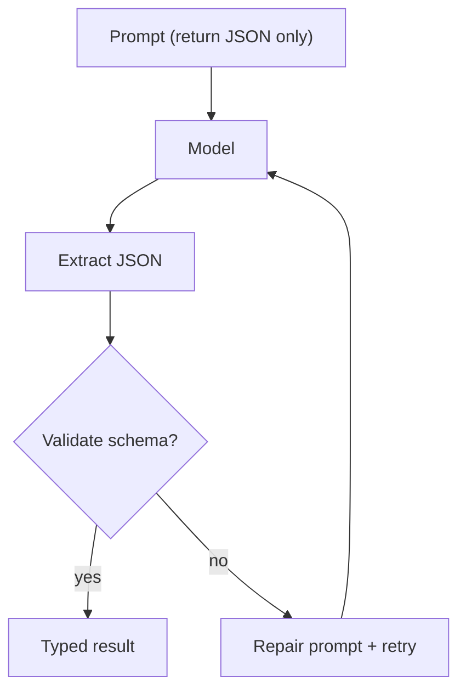

# Structured Output (JSON + Repair Loop)

## What Problem It Solves

Once you want a model to output **machine-readable data** (route choice, tool call, plan, etc.), plain text is fragile:

- extra prose around JSON
- code fences
- missing keys / wrong types

Structured output is the **discipline layer** that makes patterns testable and reliable.

## How It Works (Core Loop)

1. Ask for JSON.
2. Extract the first parsable JSON value.
3. Validate it with a small parser.
4. If invalid, send a **repair prompt** and retry.



## When to Use

- Routing decisions
- Tool calls and action schemas
- Plans (list of steps)
- Any API-like output you want to test offline

## Worked Example

The first model response is *valid JSON* but fails schema validation. The second fixes it.

```python
from typing import Any

from agent_patterns_lab.runtime import Message, MockLLM, SchemaValidationError, structured_complete

model = MockLLM(['{"answer": 123}', '{"answer": "hello"}'])

messages = [
    Message(role="system", content='Return ONLY JSON like: {"answer": "<string>"}'),
    Message(role="user", content="Say hello."),
]

def parse_answer(value: Any) -> str:
    if not isinstance(value, dict):
        raise SchemaValidationError("expected object")
    answer = value.get("answer")
    if not isinstance(answer, str):
        raise SchemaValidationError('"answer" must be string')
    return answer

out = structured_complete(model, messages, parser=parse_answer, schema_hint='{"answer":"<string>"}')
assert out == "hello"
```

## Failure Modes & Mitigations

- **Model keeps refusing “JSON only”**: tighten the system prompt; reduce temperature; add more retries.
- **Schema becomes huge**: split into smaller steps (workflow) and validate per step.
- **Repair loop hides real issues**: emit traces for every attempt and count repair rates.

## Repo Reference

- Implementation: [`src/agent_patterns_lab/runtime/structured.py`](https://github.com/lifeodyssey/agent-patterns-lab/blob/main/src/agent_patterns_lab/runtime/structured.py)
- Examples: [`examples/10_structured_output.py`](https://github.com/lifeodyssey/agent-patterns-lab/blob/main/examples/10_structured_output.py)
- Tests: [`tests/test_structured.py`](https://github.com/lifeodyssey/agent-patterns-lab/blob/main/tests/test_structured.py)
