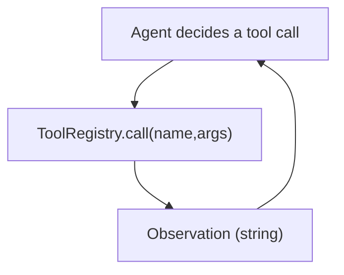

# Tool Calling (Registry + Protocol)

## The Problem It Solves

Agents need to **act**: call search, calculators, file ops, APIs, etc. Tool calling turns actions into:

- explicit names + args
- traceable and testable operations
- policy/guardrail enforcement points

## Minimal Shape

- Register tools by name.
- Execute a tool by `name(args)`.
- Return a string observation (feed back into the loop).

## Common Failure Modes

- Tool not found
- Tool throws exception
- Tool output too large / unsafe

These are exactly why **governance** (policy/guardrails/HITL) hooks exist.

## Repo Reference

- Implementation: `src/agent_patterns_lab/runtime/tools.py`
- Example: `examples/20_tool_calling.py`
- Tests: `tests/test_tools.py`

