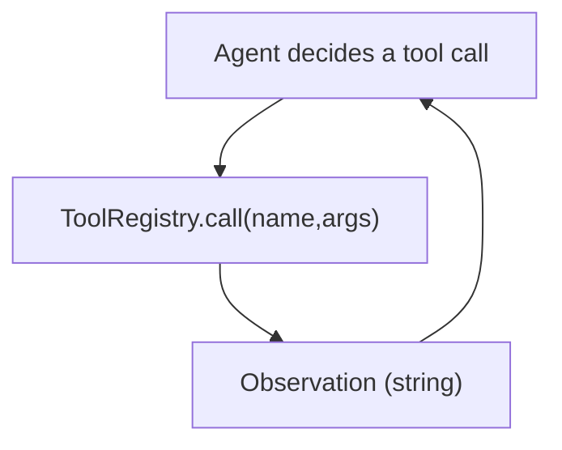

# Tool Calling (Registry + Protocol)

## What Problem It Solves

Agents need to **act**: call search, calculators, file ops, APIs, etc. Tool calling turns actions into:

- explicit names + args
- traceable and testable operations
- policy/guardrail enforcement points

## How It Works (in This Repo)

The runtime keeps tools intentionally simple:

- `Tool(name, description, handler)` is a thin wrapper.
- `ToolRegistry` stores tools by name and exposes `call(name, args) -> str`.
- Tool results are treated as **observations** and fed back into the agent loop.



The key idea: tools are where the agent touches the world. That makes tool calls the natural place to attach tracing, policies, guardrails, and approvals.

## When to Use / When NOT to Use

Use tool calling when:

- the answer depends on fresh or external information (retrieval, APIs, files)
- you need actions, not just text (write a file, run a command, send a message)

Avoid tools when:

- the task is purely internal reasoning (you’ll just add latency and failure modes)
- the tool output can’t be trusted and you don’t have a validation plan

## Worked Example

```python
from agent_patterns_lab.runtime import Tool, ToolRegistry

def add(args: dict) -> str:
    a = int(args.get("a", 0))
    b = int(args.get("b", 0))
    return str(a + b)

tools = ToolRegistry(
    [
        Tool(name="add", description="Add two integers.", handler=add),
    ]
)

out = tools.call("add", {"a": 2, "b": 3})
assert out == "5"
```

## Common Failure Modes

- Tool not found
- Tool throws exception
- Tool output too large / unsafe

These are exactly why **governance** (policy/guardrails/HITL) hooks exist.

## Failure Modes & Mitigations

- **Tool errors**: return structured error strings, or raise and let the loop decide (this repo supports both).
- **Huge outputs**: add truncation, summaries, or “store and reference” semantics.
- **Prompt injection via tool output**: treat observations as untrusted input; keep “instructions” separate.

## Repo Reference

- Implementation: [`src/agent_patterns_lab/runtime/tools.py`](https://github.com/lifeodyssey/agent-patterns-lab/blob/main/src/agent_patterns_lab/runtime/tools.py)
- Example: [`examples/20_tool_calling.py`](https://github.com/lifeodyssey/agent-patterns-lab/blob/main/examples/20_tool_calling.py)
- Tests: [`tests/test_tools.py`](https://github.com/lifeodyssey/agent-patterns-lab/blob/main/tests/test_tools.py)
