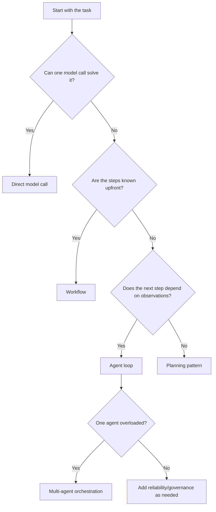

# Choose a Pattern

Do not choose patterns by name. Choose them by the failure mode you are trying to remove.

## First Question: Who Controls the Next Step?

This question matters more than the pattern name:

- **Workflow**: code decides the path.
- **Agent loop**: the model decides the next action.
- **Multi-agent**: multiple controllers coordinate.

## Symptom Table

| What you see | Start with | Why |
|---|---|---|
| Output format keeps breaking | Structured Output | Text needs parse/validate/repair discipline. |
| The task has fixed steps | Prompt Chaining | Make the pipeline explicit and testable. |
| Inputs belong to different task types | Routing | Pick the right workflow/toolset before doing work. |
| Tool calls are needed, but the count is unknown | ReAct | Use observation feedback to choose the next action. |
| One retrieval pass misses key evidence | Retrieval Loop | Let the query improve after reading results. |
| Retrieval needs citations and audit trail | Agentic RAG | Keep evidence in a ledger and answer from it. |
| The model produces plausible but wrong answers | Maker-Checker or CoVe | Add critique and verification before final output. |
| Results vary too much across runs | Voting | Sample several answers and aggregate. |
| The plan can become wrong mid-run | Planner-Executor-Replanner | Make re-planning explicit and budgeted. |
| Tool calls have dependencies or can run in parallel | LLM Compiler | Compile plan steps into a DAG. |
| The search space has many possible paths | LATS | Explore and score trajectories before committing. |
| One agent has too many responsibilities | Manager-Worker | Split work into owned subtasks. |
| Specialized agents should be callable behind one interface | Agents-as-Tools | Put specialists behind a tool boundary. |
| A task should move to a different specialist over time | Handoff | Route ownership as state changes. |
| Several agents need to critique or debate | Group Chat | Coordinate a shared discussion with a selector. |
| A long task stalls or loses track | Magentic Orchestration | Use a task ledger and stall detection. |
| Tool calls can be risky | Policy + Guardrails + HITL | Add permission checks, tripwires, and approvals. |
| You cannot tell whether changes helped | Tracing + Eval Harness | Make behavior visible and regression-testable. |

## A Practical Reading Order

If you are learning from scratch:

1. [Start Here](start_here.md)
2. [Mental Model](mental_model.md)
3. [ReAct](patterns/react.md)
4. [Prompt Chaining](patterns/workflow_chaining.md)
5. [Routing](patterns/routing.md)
6. [Agentic RAG](patterns/agentic_rag.md)
7. [Planner-Executor-Replanner](patterns/planner_executor_replanner.md)
8. [Manager-Worker](patterns/manager_worker.md)

After that, jump by symptom.

## The Cost Rule

Every pattern buys something and charges something.

| Pattern family | Buys | Charges |
|---|---|---|
| Workflow | predictability | more fixed steps |
| Agent loop | flexibility | cost, latency, loop failures |
| Reliability | trust | extra calls and stricter interfaces |
| Retrieval | knowledge | source quality and citation risk |
| Planning/search | longer horizon | budget and state management |
| Multi-agent | specialization | coordination overhead |
| Governance/eval | shippability | more instrumentation |

Start small. Add the next layer only when the failure mode is real.

