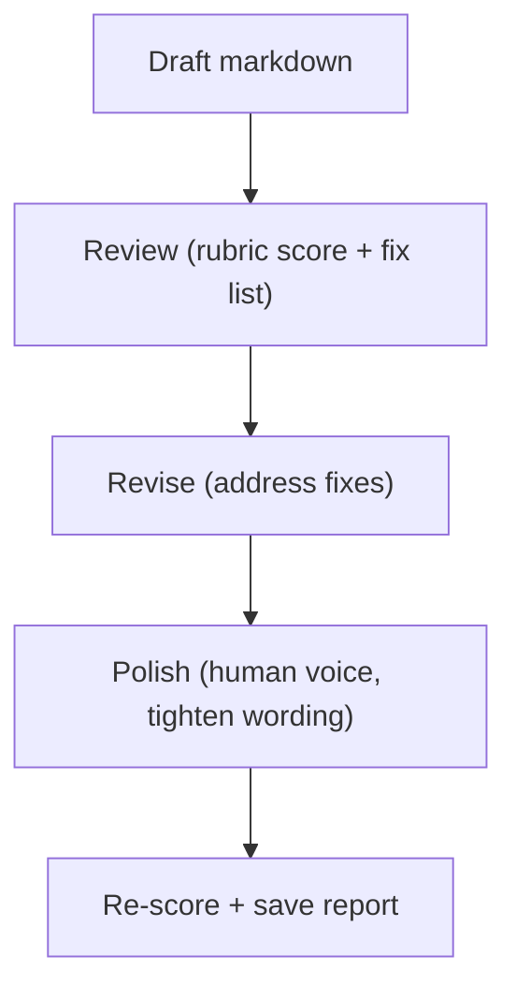

# Editorial Rubric (review → revise → polish)

This repo treats documentation quality as an **engineering surface**: you can review it, score it, iterate, and regress-test it.

## What Problem It Solves

Docs rot in two ways:

- they stay “technically correct” but stop being usable
- they become template-y and nobody wants to read them

The goal here is simple: make quality visible (scores + notes), and make improvement repeatable (a loop you can rerun).

## The Loop



## How It Works (in This Repo)

The pipeline is implemented in `agent_patterns_lab.runtime.editorial`:

- `Review`: rubric score + fix list (structured JSON)
- `Revise`: apply the fixes (rewrite markdown)
- `Polish`: make it read like a human wrote it (still technical, less template)

Each stage is scored so you can see whether changes actually improved things.

## Rubric (0–5)

We score each page on five dimensions (0–5):

- **Clarity**: plain explanations, defined terms, short paragraphs.
- **Actionability**: steps, pseudo-code, concrete inputs/outputs.
- **Boundaries**: when to use / when not to use, failure modes, stop conditions, costs.
- **Example quality**: at least one worked example (not just a diagram).
- **Terminology consistency**: stable naming across the page (no accidental synonyms).

Score meaning:

- `0`: unusable / misleading
- `2`: partially helpful but missing core pieces
- `3`: workable, but gaps exist
- `4`: strong, only minor gaps
- `5`: excellent, crisp and shippable

## “Human voice” checklist (what we optimize for)

Not “casual”. Just **written by a person**:

- Cut filler phrases and template transitions (avoid conclusion boilerplate and stock transitions).
- Mix sentence length and rhythm. A few short lines are fine.
- Prefer concrete claims over vague ones (show 1 real example instead of 5 generic bullets).
- Avoid hype. Take a clear stance when it helps the reader decide.

## When to Use / When NOT to Use

**Use it when:**

- You maintain a set of pages over time (patterns, internal docs, runbooks).
- You want a shared, repeatable definition of “good docs” (not vibes).
- You run a bilingual site and need terminology + structure to stay aligned.

**Skip it when:**

- You’re writing a one-off note that won’t be revisited.
- Your main risk is factual correctness (that’s a CoVe/tests problem, not polish).

## Run it (CLI)

Offline scoring (no rewrite):

```bash
UV_CACHE_DIR=.uv_cache PYTHONPATH=src uv run --no-sync python -m agent_patterns_lab.runtime.editorial \
  --mode offline --input docs --out-dir .editorial
```

Live rewrite (OpenAI / Anthropic) is the same command with `--mode openai|anthropic` + API keys (see `README.md`).

## Worked Example

Goal: review a single page (no rewrite) and inspect the JSON report.

```bash
UV_CACHE_DIR=.uv_cache PYTHONPATH=src uv run --no-sync python -m agent_patterns_lab.runtime.editorial \
  --mode offline \
  --input docs/en/patterns/react.md \
  --out-dir .editorial
```

Outputs:

- `.editorial/reports/en/en/patterns/react.json` (scores + fix list)
- `.editorial/REPORT.md` (aggregate report)
- `.traces/editorial/editorial.jsonl` (trace)

## Failure Modes & Mitigations

- **Rubric becomes cargo cult**: score, but also read the page; treat scores as a prompt for discussion.
- **Polish kills precision**: keep “polish” focused on rhythm and specificity, not rewriting meaning.
- **Bilingual drift**: run the pipeline per locale, and keep terminology mapping explicit.

## References (on “human voice”)

These aren’t “AI tricks”. They’re just solid editing habits:

- Microsoft Copilot — *How to humanize AI text*: https://www.microsoft.com/en-us/microsoft-copilot/copilot-101/humanize-ai-text
- How-To Geek — *How to avoid sounding like AI*: https://www.howtogeek.com/how-to-avoid-sounding-like-ai-in-your-writing/
- Adobe — *Conciseness in writing* (filler words, active voice): https://www.adobe.com/acrobat/resources/conciseness-in-writing.html
