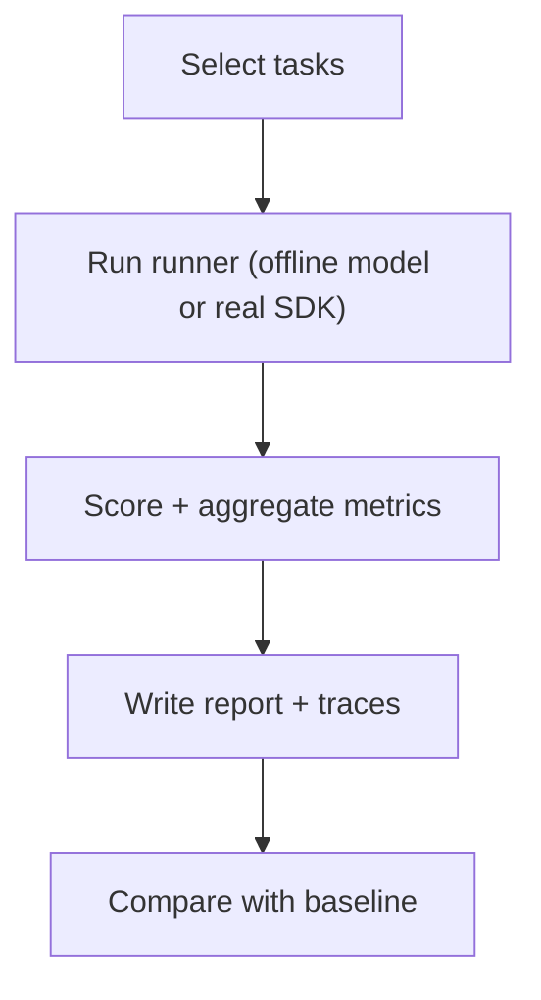

# Eval Harness (Regression Tests for Agents)

## What Problem It Solves

Agents are **non-deterministic programs**: small prompt/tool/policy changes can silently break behavior.

An eval harness provides:

- a fixed set of tasks (offline-first)
- repeatable scoring (pass/fail + metrics)
- trace artifacts for debugging regressions

## When to Use

- You ship agents and want “CI for agent behavior”.
- You add new patterns, tools, or guardrails and need confidence.
- You want to compare variants (e.g., ReAct vs. Plan & Solve) on the same task set.

## Core Flow

## Repo Reference

- CLI: [`src/agent_patterns_lab/runtime/evals/__main__.py`](https://github.com/lifeodyssey/agent-patterns-lab/blob/main/src/agent_patterns_lab/runtime/evals/__main__.py)
- Tasks: [`src/agent_patterns_lab/runtime/evals/tasks.py`](https://github.com/lifeodyssey/agent-patterns-lab/blob/main/src/agent_patterns_lab/runtime/evals/tasks.py)
- Runner: [`src/agent_patterns_lab/runtime/evals/runner.py`](https://github.com/lifeodyssey/agent-patterns-lab/blob/main/src/agent_patterns_lab/runtime/evals/runner.py)
- Report: [`src/agent_patterns_lab/runtime/evals/report.py`](https://github.com/lifeodyssey/agent-patterns-lab/blob/main/src/agent_patterns_lab/runtime/evals/report.py)
- Tests: [`tests/test_evals_runner.py`](https://github.com/lifeodyssey/agent-patterns-lab/blob/main/tests/test_evals_runner.py)

