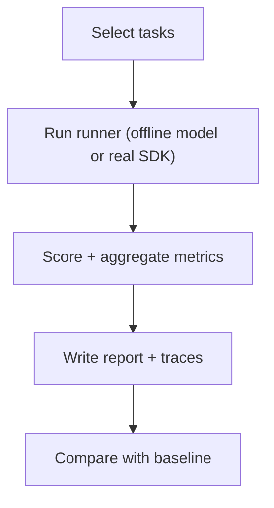

# Eval Harness (Regression Tests for Agents)

## What Problem It Solves

Agents are **non-deterministic programs**: small prompt/tool/policy changes can silently break behavior.

An eval harness provides:

- a fixed set of tasks (offline-first)
- repeatable scoring (pass/fail + metrics)
- trace artifacts for debugging regressions

## When to Use

- You ship agents and want “CI for agent behavior”.
- You add new patterns, tools, or guardrails and need confidence.
- You want to compare variants (e.g., ReAct vs. Plan & Solve) on the same task set.

## Core Flow



## How It Works (in This Repo)

The harness is intentionally small:

- **Tasks** are pure Python callables that run patterns with `MockLLM` by default.
- Each task produces a `TaskOutcome` (status + score + output + trace path).
- Reports are written as both Markdown and JSON, so you can diff baselines.

## Worked Example

Run the offline suite (no API keys, no network):

```bash
UV_CACHE_DIR=.uv_cache PYTHONPATH=src uv run --no-sync python -m agent_patterns_lab.runtime.evals --mode offline
```

Then compare against a baseline JSON:

```bash
UV_CACHE_DIR=.uv_cache PYTHONPATH=src uv run --no-sync python -m agent_patterns_lab.runtime.evals \
  --mode offline --baseline .evals/results.json
```

## Failure Modes & Mitigations

- **Flaky tasks**: keep tasks offline-first and deterministic; treat live-model evals as separate suites.
- **Scores don’t reflect reality**: make scoring explicit (rubrics/tests/tools), and store traces for audit.
- **Silent regressions**: pin baselines and diff them in CI; don’t rely on “it looks fine”.

## Repo Reference

- CLI: [`src/agent_patterns_lab/runtime/evals/__main__.py`](https://github.com/lifeodyssey/agent-patterns-lab/blob/main/src/agent_patterns_lab/runtime/evals/__main__.py)
- Tasks: [`src/agent_patterns_lab/runtime/evals/tasks.py`](https://github.com/lifeodyssey/agent-patterns-lab/blob/main/src/agent_patterns_lab/runtime/evals/tasks.py)
- Runner: [`src/agent_patterns_lab/runtime/evals/runner.py`](https://github.com/lifeodyssey/agent-patterns-lab/blob/main/src/agent_patterns_lab/runtime/evals/runner.py)
- Report: [`src/agent_patterns_lab/runtime/evals/report.py`](https://github.com/lifeodyssey/agent-patterns-lab/blob/main/src/agent_patterns_lab/runtime/evals/report.py)
- Tests: [`tests/test_evals_runner.py`](https://github.com/lifeodyssey/agent-patterns-lab/blob/main/tests/test_evals_runner.py)
