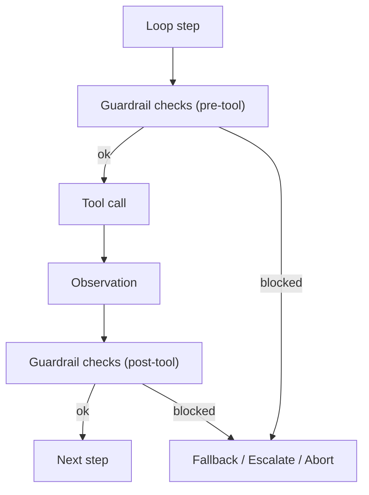

# Guardrails (Tripwires / Validators)

## What Problem It Solves

Policies answer “**is this tool call allowed**?”. Guardrails answer “**is the system behaving safely and correctly right now**?”.

Guardrails are small, composable checks that can:

- Validate tool arguments (schema/rules).
- Detect prompt injection / unsafe instructions.
- Enforce “must cite evidence” style constraints.
- Block / rewrite / escalate when something looks wrong.

## When to Use

- You have retrieval sources you don’t fully trust.
- You must enforce invariants (no secrets, no network, only whitelisted domains, etc.).
- You want defense-in-depth beyond a static allowlist.

## Core Flow

## Evolution Path

- Built on: **Policy + Loop controller + Tracing**
- Often paired with:
  - **HITL** (approval when guardrail trips)
  - **Maker-Checker / CoVe** (verification as a reliability guardrail)

## Repo Reference

- Code: [`src/agent_patterns_lab/runtime/guardrails.py`](https://github.com/lifeodyssey/agent-patterns-lab/blob/main/src/agent_patterns_lab/runtime/guardrails.py)
- Example: [`examples/66_governance_hitl_policy_guardrails.py`](https://github.com/lifeodyssey/agent-patterns-lab/blob/main/examples/66_governance_hitl_policy_guardrails.py)
- Tests: [`tests/test_guardrails.py`](https://github.com/lifeodyssey/agent-patterns-lab/blob/main/tests/test_guardrails.py)

