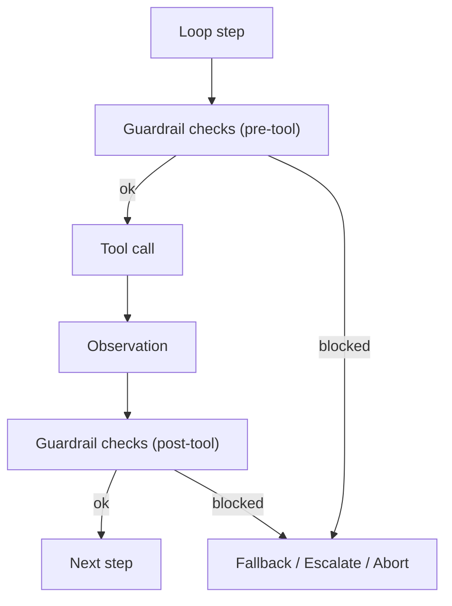

# Guardrails (Tripwires / Validators)

## What Problem It Solves

Policies answer “**is this tool call allowed**?”. Guardrails answer “**is the system behaving safely and correctly right now**?”.

Guardrails are small, composable checks that can:

- Validate tool arguments (schema/rules).
- Detect prompt injection / unsafe instructions.
- Enforce “must cite evidence” style constraints.
- Block / rewrite / escalate when something looks wrong.

## When to Use

- You have retrieval sources you don’t fully trust.
- You must enforce invariants (no secrets, no network, only whitelisted domains, etc.).
- You want defense-in-depth beyond a static allowlist.

## How It Works (in This Repo)

Guardrails are small checks you run around risky boundaries:

- **pre-tool**: validate tool name + args (often overlaps with policy)
- **post-tool**: validate tool output (size, banned patterns, schema)
- **pre-final**: validate the model’s final output (format, citations, no secrets)

This repo implements a tiny set of tripwires (e.g., `BannedRegexTripwire`, `MaxChars`) and a `Guardrails` container that runs them consistently.

## Core Flow



## Worked Example

Block tool output that contains `ERROR`:

```python
from agent_patterns_lab.runtime import BannedRegexTripwire, Guardrails

guardrails = Guardrails(tool_output_text=[BannedRegexTripwire(patterns=[r"ERROR"])])
guardrails.check_tool_output("OK")      # pass
guardrails.check_tool_output("ERROR!")  # raises TripwireTriggered
```

## Failure Modes & Mitigations

- **False positives**: tune patterns, add allowlists, and make blocks explainable.
- **Guardrails become “policy #2”**: keep responsibilities clear (policy = capability, guardrails = runtime behavior).
- **Bypass risk**: enforce guardrails at the runner boundary, not only inside patterns.

## Evolution Path

- Built on: **Policy + Loop controller + Tracing**
- Often paired with:
  - **HITL** (approval when guardrail trips)
  - **Maker-Checker / CoVe** (verification as a reliability guardrail)

## Repo Reference

- Code: [`src/agent_patterns_lab/runtime/guardrails.py`](https://github.com/lifeodyssey/agent-patterns-lab/blob/main/src/agent_patterns_lab/runtime/guardrails.py)
- Example: [`examples/66_governance_hitl_policy_guardrails.py`](https://github.com/lifeodyssey/agent-patterns-lab/blob/main/examples/66_governance_hitl_policy_guardrails.py)
- Tests: [`tests/test_guardrails.py`](https://github.com/lifeodyssey/agent-patterns-lab/blob/main/tests/test_guardrails.py)
