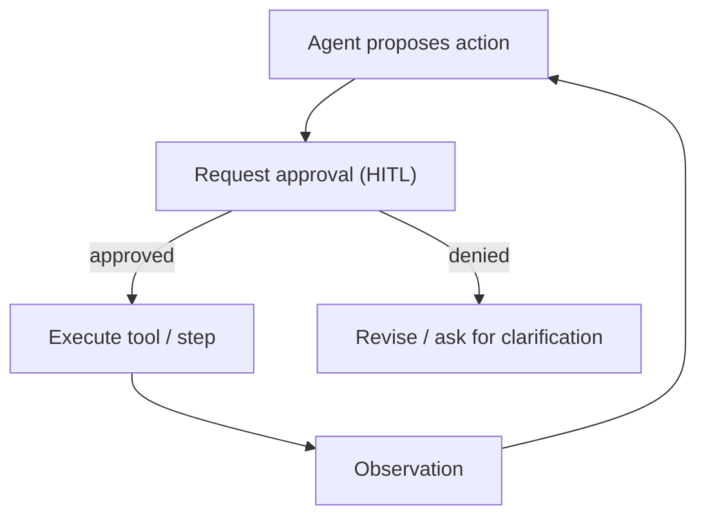

# HITL (Human-in-the-Loop Approval)

## What Problem It Solves

For high-risk actions, “best-effort” automation is not enough. HITL adds a **human approval gate**:

- approve/deny tool calls (or full plans)
- collect clarifications (missing info, ambiguous intent)
- create an auditable decision trail

## When to Use

- The agent can trigger irreversible actions (payments, deletions, email sending).
- You need operational control and accountability.
- You want a safe path to gradually increase autonomy.

## Core Flow

## Evolution Path

- Built on: **Policy + Guardrails**
- Next steps:
  - **Multi-agent handoff** (triage to the right human role/team)
  - **Eval harness** (ensure approval thresholds and risk logic stay stable)

## Repo Reference

- Code: [`src/agent_patterns_lab/runtime/hitl.py`](https://github.com/lifeodyssey/agent-patterns-lab/blob/main/src/agent_patterns_lab/runtime/hitl.py)
- Example: [`examples/66_governance_hitl_policy_guardrails.py`](https://github.com/lifeodyssey/agent-patterns-lab/blob/main/examples/66_governance_hitl_policy_guardrails.py)
- Tests: [`tests/test_hitl.py`](https://github.com/lifeodyssey/agent-patterns-lab/blob/main/tests/test_hitl.py)

