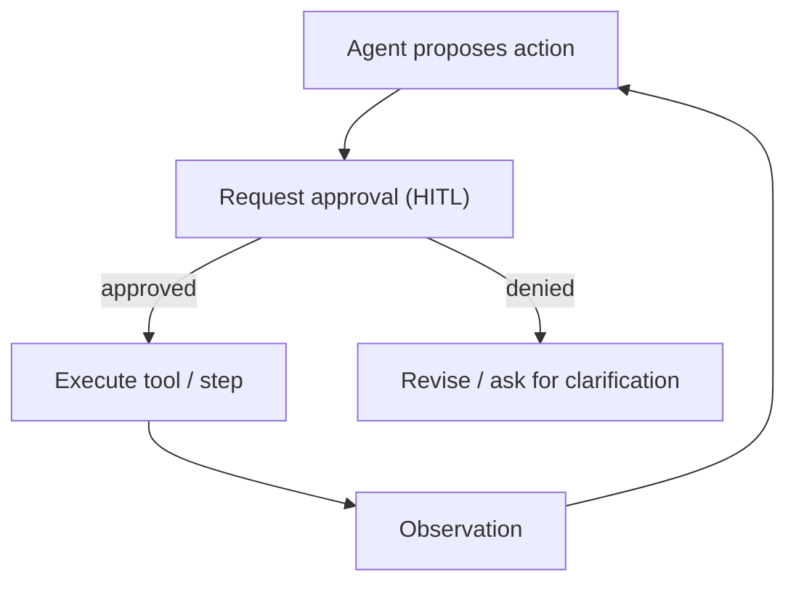

# HITL (Human-in-the-Loop Approval)

## What Problem It Solves

For high-risk actions, “best-effort” automation is not enough. HITL adds a **human approval gate**:

- approve/deny tool calls (or full plans)
- collect clarifications (missing info, ambiguous intent)
- create an auditable decision trail

## When to Use

- The agent can trigger irreversible actions (payments, deletions, email sending).
- You need operational control and accountability.
- You want a safe path to gradually increase autonomy.

## How It Works (in This Repo)

The runtime uses a simple interrupt/resume contract:

1. Call `hitl.check(tool, args)` before a risky action.
2. If approval is needed, it raises `NeedsApproval(request)`.
3. A human (or offline `ScriptedApprover`) decides.
4. You call `hitl.approve(request)` (or `deny`) and retry the same step.

The `ApprovalRequest.id` is stable for the same `(tool, args)`, so you can approve once and resume safely.

## Core Flow



## Worked Example

```python
from agent_patterns_lab.runtime import HITLController, NeedsApproval

hitl = HITLController(require_approval_for_tools={"deploy"})

try:
    hitl.check("deploy", {"env": "prod"}, reason="prod_requires_approval")
except NeedsApproval as e:
    # show e.request to a human, then approve/deny
    hitl.approve(e.request)

# retry the same tool call after approval
hitl.check("deploy", {"env": "prod"}, reason="prod_requires_approval")  # now passes
```

## Failure Modes & Mitigations

- **Approval spam**: approve at the right granularity (tool + args hash), and cache approvals.
- **Wrong human gets paged**: pair with handoff/triage (route approvals by tool/risk).
- **“Human always approves”**: make the request explicit (reason, diff, blast radius) and log decisions.

## Evolution Path

- Built on: **Policy + Guardrails**
- Next steps:
  - **Multi-agent handoff** (triage to the right human role/team)
  - **Eval harness** (ensure approval thresholds and risk logic stay stable)

## Repo Reference

- Code: [`src/agent_patterns_lab/runtime/hitl.py`](https://github.com/lifeodyssey/agent-patterns-lab/blob/main/src/agent_patterns_lab/runtime/hitl.py)
- Example: [`examples/66_governance_hitl_policy_guardrails.py`](https://github.com/lifeodyssey/agent-patterns-lab/blob/main/examples/66_governance_hitl_policy_guardrails.py)
- Tests: [`tests/test_hitl.py`](https://github.com/lifeodyssey/agent-patterns-lab/blob/main/tests/test_hitl.py)
