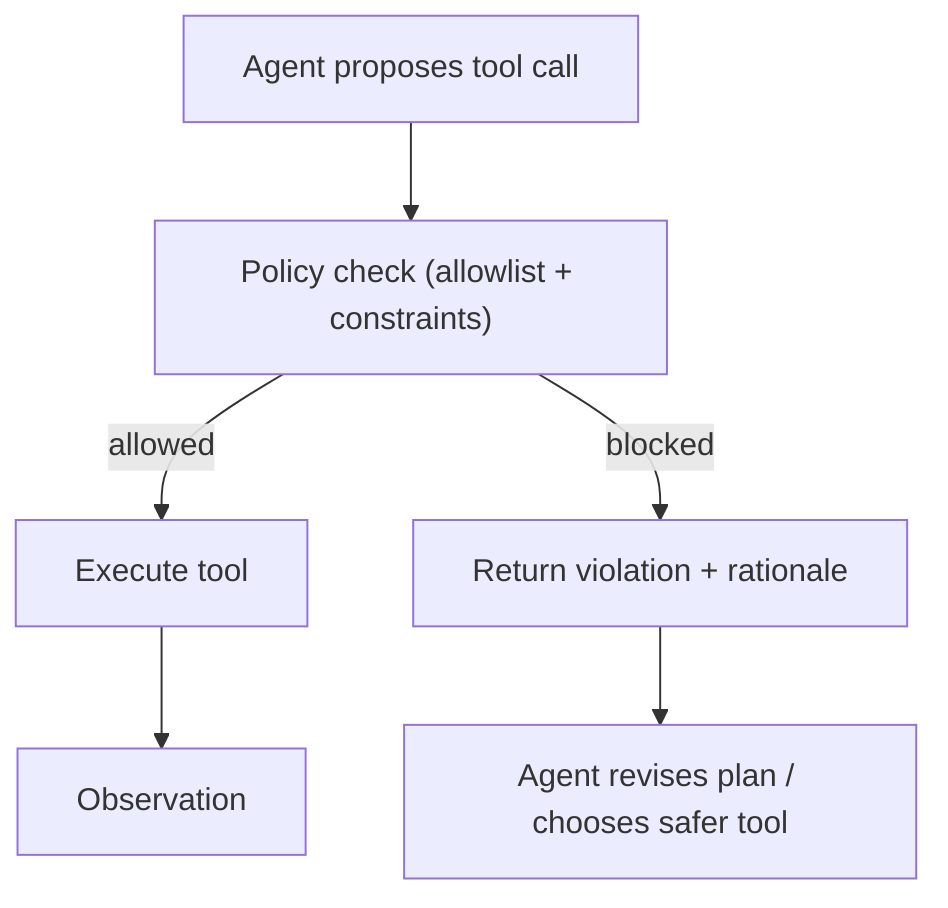

# Policy (Capability Control / Tool Allowlist)

## What Problem It Solves

As soon as an agent can call tools, you need a **capability boundary**:

- Prevent unsafe or out-of-scope actions (e.g., deleting files, sending data out).
- Limit costs (rate limits, model/tool budgets).
- Make tool use auditable and reviewable.

In practice, “policy” usually means **allowlist/denylist + constraints** applied to every tool call.

## When to Use

- You plan to ship an agent that can take real actions.
- You have multiple tools with different risk levels.
- You need centralized control that works across many patterns (ReAct, Agentic RAG, multi-agent).

## Core Flow

## Evolution Path

- Built on: **Tool calling + Structured output + Loop controller**
- Common next steps:
  - **Guardrails** (tripwires/validators around prompts, tool args, and observations)
  - **HITL** (human approval for high-risk tool calls)
  - **Evaluation** (ensure policy rules don’t regress silently)

## Repo Reference

- Code: `src/agent_patterns_lab/runtime/policy.py`
- Example: `examples/66_governance_hitl_policy_guardrails.py`
- Tests: `tests/test_policy.py`

