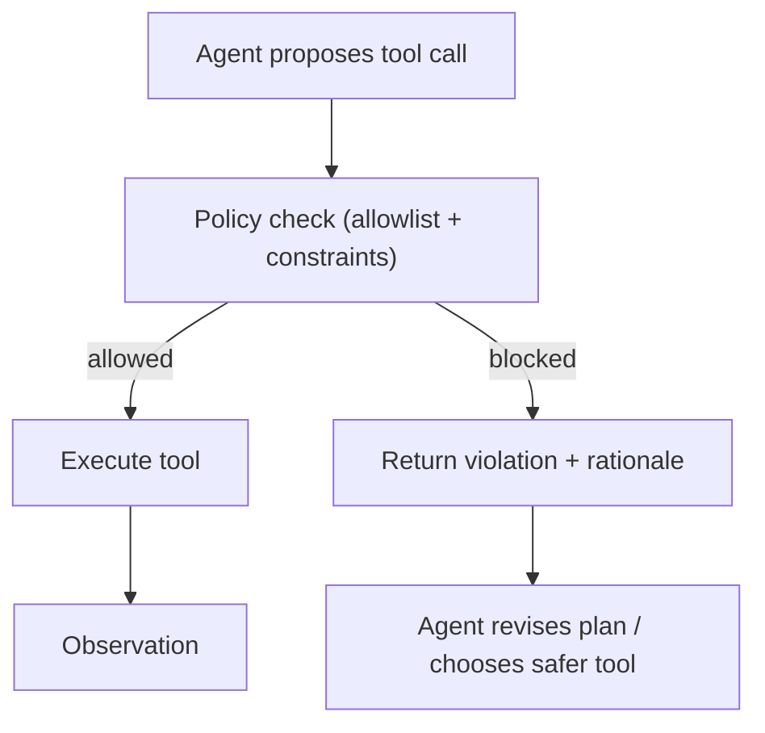

# Policy (Capability Control / Tool Allowlist)

## What Problem It Solves

As soon as an agent can call tools, you need a **capability boundary**:

- Prevent unsafe or out-of-scope actions (e.g., deleting files, sending data out).
- Limit costs (rate limits, model/tool budgets).
- Make tool use auditable and reviewable.

In practice, “policy” usually means **allowlist/denylist + constraints** applied to every tool call.

## When to Use

- You plan to ship an agent that can take real actions.
- You have multiple tools with different risk levels.
- You need centralized control that works across many patterns (ReAct, Agentic RAG, multi-agent).

## How It Works (in This Repo)

The runtime policy is intentionally minimal:

- `ToolPolicy`: allowlist/denylist tools + optional per-tool argument rules.
- `ToolArgsPolicy`: required keys, allowed keys, and per-parameter bounds.
- `ParamBound`: simple constraints (min/max, length, regex, allowed values).

You typically run `policy.check_tool_call(tool_name, tool_args)` **right before** the tool executes.

## Core Flow



## Worked Example

Allow only `deploy(env=dev|staging|prod)`:

```python
from agent_patterns_lab.runtime import ParamBound, ToolArgsPolicy, ToolPolicy

policy = ToolPolicy(
    allowed_tools={"deploy"},
    per_tool={
        "deploy": ToolArgsPolicy(
            required_keys={"env"},
            bounds={"env": ParamBound(pattern=r"(dev|staging|prod)")},
        )
    },
)

policy.check_tool_call("deploy", {"env": "prod"})  # ok
```

## Failure Modes & Mitigations

- **Policy sprawl**: treat policy rules like code (review, tests, versioning).
- **Over-blocking**: log violations and tune; add a safe fallback path instead of hard fail for low risk.
- **Under-blocking**: start tight (allowlist), then widen intentionally; don’t ship “*”.

## Evolution Path

- Built on: **Tool calling + Structured output + Loop controller**
- Common next steps:
  - **Guardrails** (tripwires/validators around prompts, tool args, and observations)
  - **HITL** (human approval for high-risk tool calls)
  - **Evaluation** (ensure policy rules don’t regress silently)

## Repo Reference

- Code: [`src/agent_patterns_lab/runtime/policy.py`](https://github.com/lifeodyssey/agent-patterns-lab/blob/main/src/agent_patterns_lab/runtime/policy.py)
- Example: [`examples/66_governance_hitl_policy_guardrails.py`](https://github.com/lifeodyssey/agent-patterns-lab/blob/main/examples/66_governance_hitl_policy_guardrails.py)
- Tests: [`tests/test_policy.py`](https://github.com/lifeodyssey/agent-patterns-lab/blob/main/tests/test_policy.py)
