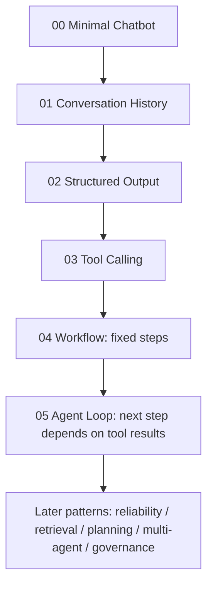
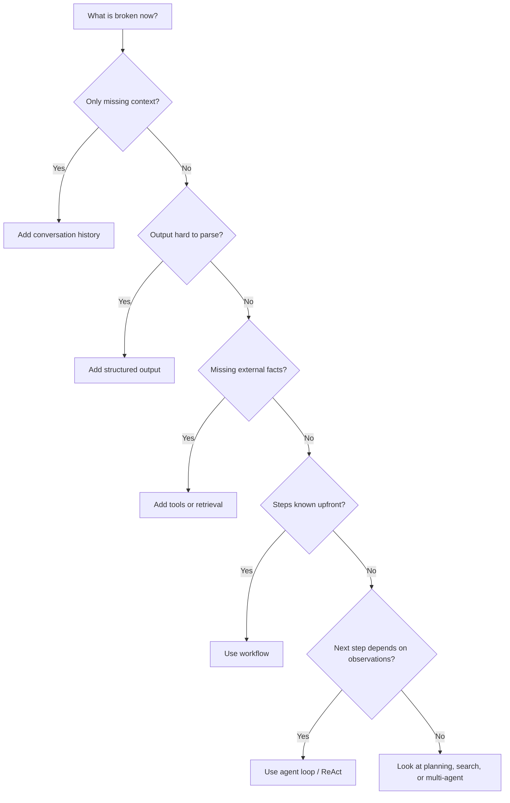

# Agent Patterns Lab

Many agent tutorials start with ReAct, planning, or multi-agent systems.
Those ideas are useful, but they can make agents feel like a big framework or a bag of magic prompts.

This site starts smaller.

Write a plain chatbot first: the user sends a message, the model returns text. It looks fine for a minute. Then you ask it to plan a trip. It does not know whether it will rain today. It forgets the budget from the previous turn. Its output alternates between clean itinerary and loose prose. If you give it tools, it still has to decide which tool to call, how many times, and when to stop.

Agent design patterns grow out of those failures.

This is not mainly a repo manual. It is a map: when a normal chatbot breaks in a specific way, what structure should you add next, why does that structure exist, and what does it cost?

The recurring example is a travel planning assistant. We start here:

```python
answer = model.complete(messages)
```

Then we move one layer at a time:

```text
Chatbot -> conversation history -> structured output -> tools -> workflow -> agent loop -> reliability / retrieval / planning / multi-agent / governance
```

## What Problem It Solves

After reading, you should be able to answer three questions:

- Where does an agent differ from a normal chatbot?
- What failure does each design pattern remove?
- When should you add another layer, and when should you stop?

The short version: name the failure first, then choose the pattern.

## How It Works

Each pattern page follows the same path:

1. Explain the problem it solves.
2. Draw the flow.
3. Show a Python example that matches the flow.
4. Name the boundary: when it helps, and when it makes the system heavier.

This is slower than listing patterns, but it keeps the names attached to code.

## Map



## Why Start With a Chatbot

Agents do not appear out of nowhere.
They are what a chatbot becomes after real tasks keep exposing missing structure.

| Failure | Pattern pressure |
|---|---|
| The next user message depends on the previous one | Add conversation history. |
| Prose is hard to parse | Add structured output. |
| The model lacks live facts | Add tools or retrieval. |
| The steps are known upfront | Use a workflow. |
| The next step depends on tool results | Use an agent loop. |
| The answer is plausible but wrong | Add checking, verification, or voting. |
| The plan changes mid-task | Add planning and replanning. |
| One agent owns too much | Split into multi-agent orchestration. |
| Actions can affect the outside world | Add policy, guardrails, HITL, and evals. |

Here is the rough decision map:



Do not stack patterns because the names sound impressive.
Name the failure first, then add the smallest next layer.

## When to Use This Map

Use it when:

- You want to write a report on agent design patterns.
- You want to understand the smallest Python implementation of each pattern.
- You have heard the pattern names, but the relationships still feel scattered.

Do not use it as:

- A complete SDK reference.
- A production framework recommendation.
- A ready-made business application.

Think of it as a teardown.
First see the parts. Then decide what belongs in a product.

## Common Failure Modes

This material can fail too:

- If it only lists names, it becomes a glossary.
- If it only explains the repo, it becomes a README.
- If it only explains theory, the patterns stay vague.

So the pages try to keep explanation, flow diagrams, and small code examples together.

## Start Here

1. [Start Here](start_here.md)
2. [00: Minimal Chatbot](tutorial/00_chatbot.md)
3. [01: Conversation History](tutorial/01_conversation.md)
4. [02: Structured Output](tutorial/02_structured_output.md)
5. [03: Tool Calling](tutorial/03_tool_calling.md)
6. [04: Workflow](tutorial/04_workflow.md)
7. [05: Agent Loop](tutorial/05_agent_loop.md)
8. [Choose a Pattern](choose_pattern.md)

The repo currently documents **21 agent design patterns**, plus supporting building-block, governance, and evaluation pages.

If you only want intuition, read the first six tutorial pages.
If you are writing a fuller report, use [Choose a Pattern](choose_pattern.md) as the map.
