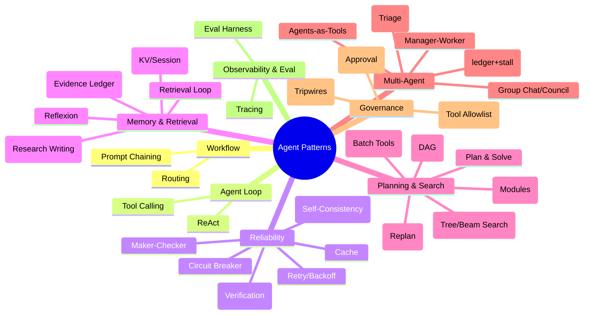
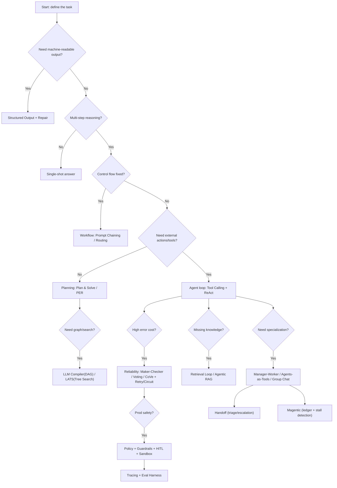

# Agent Design Patterns Map

This site is a **problem-driven map** of common agent design patterns.

The core idea: *patterns are not “fancier = better”*. They are **responses to new failure modes** that appear when you add tools, longer horizons, retrieval, multiple agents, and production constraints.

## The Evolution Thread (Simple → Complex)

1. **Single-shot** (no loop): fast, cheap, but fragile.
2. **Structured output**: when you need machine-readable JSON, add parsing + repair retries.
3. **Workflows**: when the control flow is known, use Prompt Chaining / Routing.
4. **Agent loop**: when the next step depends on observations, use Tool Calling + ReAct.
5. **Reliability**: when mistakes are costly, add Maker-Checker / Voting / CoVe + retries/circuit breakers.
6. **Memory & Retrieval**: when knowledge is missing, add Retrieval Loop → Agentic RAG + evidence ledger.
7. **Planning & Search**: when tasks are long-horizon, add Plan & Solve / PER / REWOO / DAG / Tree Search.
8. **Multi-agent**: when you need specialization and scale, use Manager-Worker / Agents-as-Tools / Group Chat / Handoff / Magentic.
9. **Governance & Eval**: when shipping, add Policy + Guardrails + HITL + Tracing + Eval Harness.

## Mind Map (Pattern Families)

## “If You See X, Use Y” (Decision Tree)

## How This Book Is Organized

- **Building Blocks**: the minimal runtime features that patterns reuse (structured output, tools, loops, tracing, memory, etc.).
- **Patterns**: one page per pattern, focusing on *problem → core loop → trade-offs → evolution path*.
- **Governance & Evaluation**: how to make the system shippable and regressions detectable.

