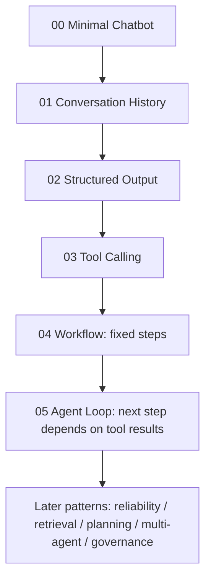

# Agent Patterns Lab

This site is not mainly a repo manual. It explains **why a normal chatbot gradually evolves into an agent system**.

Recurring example:

```text
Chatbot -> conversation history -> structured output -> tools -> workflow -> agent loop -> reliability / retrieval / planning / multi-agent / governance
```

## Map



## Start Here

1. [Start Here](start_here.md)
2. [00: Minimal Chatbot](tutorial/00_chatbot.md)
3. [01: Conversation History](tutorial/01_conversation.md)
4. [02: Structured Output](tutorial/02_structured_output.md)
5. [03: Tool Calling](tutorial/03_tool_calling.md)
6. [04: Workflow](tutorial/04_workflow.md)
7. [05: Agent Loop](tutorial/05_agent_loop.md)
8. [Choose a Pattern](choose_pattern.md)

The repo currently documents **21 agent design patterns**, plus supporting building-block, governance, and evaluation pages.
