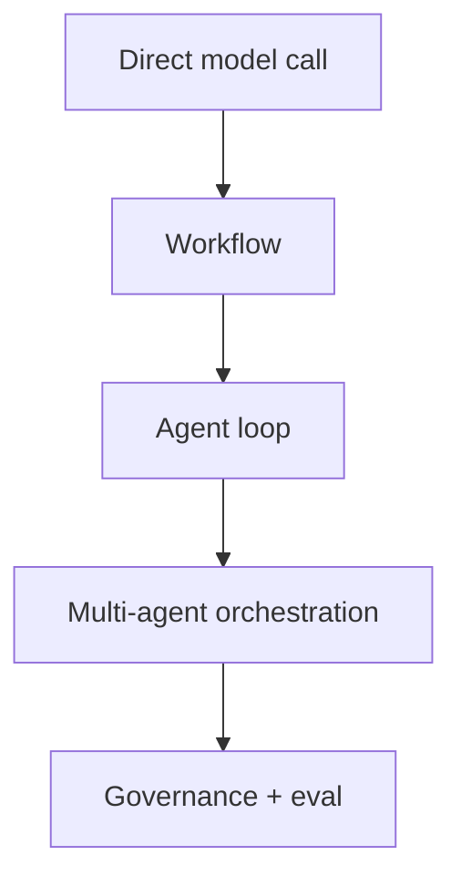

# Mental Model

Most confusion around agent patterns comes from mixing three things:

- workflows
- agent loops
- multi-agent orchestration

They are related, but they are not the same move.

## The Short Version



As you move right, you gain flexibility. You also pay in latency, cost, testing difficulty, and failure modes.

## 1. Direct Model Call

Use one model call when the task is single-step:

- summarize
- classify
- rewrite
- extract a small field

If a single call works and you can test it, stop there.

## 2. Workflow

A workflow means **code controls the path**.

The system decides the steps ahead of time:

```text
extract -> validate -> rewrite -> final
```

Use workflows when the control flow is known. They are usually cheaper, easier to debug, and easier to test than agents.

Common patterns:

- Prompt Chaining
- Routing
- Maker-Checker
- Voting

## 3. Agent Loop

An agent loop means **the model chooses the next step**.

The runtime repeats:

```text
state -> decide action -> act -> observe -> update state
```

Use an agent loop when the next step depends on observations:

- tool output
- search result
- file contents
- API response
- user clarification

This is where ReAct lives.

## 4. Multi-Agent Orchestration

Multi-agent orchestration means you now have more than one specialized controller.

Use it when one agent has become too overloaded:

- too many tools
- too many domains
- conflicting policies
- work that can be split across specialists

Multi-agent is not automatically smarter. It is coordination machinery. Reach for it when specialization reduces complexity more than coordination adds it.

## The Rule of Thumb

Use the lowest level of complexity that fixes the failure mode.

| If this works… | Stay there |
|---|---|
| One prompt | Direct model call |
| Fixed steps | Workflow |
| Unknown number of tool calls | Agent loop |
| Specialist boundaries matter | Multi-agent |
| Real users / risky actions | Governance + eval |

## What This Repo Teaches

The code is intentionally small. The goal is not to hide complexity behind a framework. The goal is to expose the control loop so you can see why each pattern exists.

References:

- Anthropic, [Building effective agents](https://www.anthropic.com/engineering/building-effective-agents)
- Azure, [AI agent orchestration patterns](https://learn.microsoft.com/en-us/azure/architecture/ai-ml/guide/ai-agent-design-patterns)

