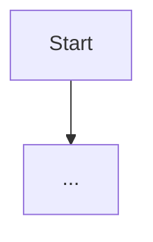

# Pattern Template (Copy this page)

> Goal: make the reader able to answer **“should I use this pattern?”** in 60 seconds.

## TL;DR (One Sentence)

Write a single sentence:

- **Pattern X =** (what loop/control structure it introduces) **to fix** (which failure mode).

## You Probably Need This When (Symptoms)

Concrete symptoms beat abstract taxonomy. Write 3–6 “if you see X…” bullets, e.g.:

- “We can’t predict how many tool calls the agent needs.”
- “The agent keeps looping without making progress.”
- “We can’t explain why the agent chose a tool.”

## What Problem It Solves

- Start with a concrete failure mode (“we tried X, it broke in Y way”).
- Name the root cause (missing observation loop? missing verification? missing budget?).

## When to Use / When NOT to Use

**Use when:**
- (bullet)

**Avoid when:**
- (bullet)

## Core Loop



## How It Works (Mechanics)

Explain the *mechanism*, not the vibe:

- **State**: what the loop reads/writes
- **Control variables**: budgets, stop conditions, routes
- **Interfaces**: tools, action schema, validators
- **Why it works**: what failure mode it neutralizes

## Worked Example (Minimal)

Describe a tiny runnable example:

- **Input**
- **Steps** (what the loop does)
- **Output**

Include 10–30 lines of code or a CLI command to run an existing `examples/` script.

If possible, embed the example code via snippets so the docs stay in sync:

```python
--8<-- "examples/<nn>_<pattern>.py"
```

## Failure Modes & Mitigations

List the “expected” failures and the smallest mitigations:

- loop/no-progress → max steps, stall detection
- tool failures → retry/backoff, circuit breaker, fallback
- bad citations → evidence ledger + verification

## Evolution Path (Where It Fits)

- Built on: (which building blocks / earlier patterns)
- Often combined with: (cross-cutting primitives)
- Next step: (what you add when this pattern hits its limits)

## Repo Reference

- Code: `src/agent_patterns_lab/patterns/<pattern>.py`
- Example: `examples/<nn>_<pattern>.py`
- Tests: `tests/test_<pattern>.py`

## References

- Paper / blog / docs links (keep it short)
