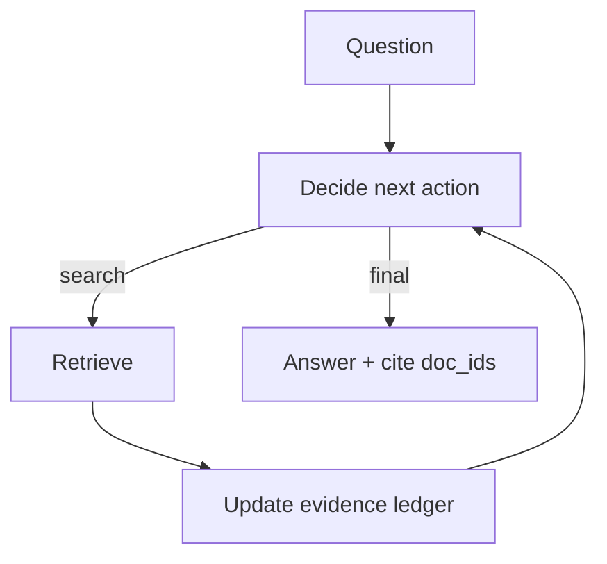

# Agentic RAG (RAG as an Agent Loop)

## What Problem It Solves

Traditional RAG is often “one retrieve → one generate”. Agentic RAG lets the model decide:

- when to retrieve
- what to retrieve
- when evidence is sufficient
- when to stop and answer

## Core Flow (ReAct + Retrieval Tool + Evidence Ledger)

## Evolution Path

- Built on: **ReAct** + **Retrieval Loop** ideas
- Frequently combined with: **CoVe** (verify claims), **Memory** (store insights)

## Repo Reference

- Code: `src/agent_patterns_lab/patterns/agentic_rag.py`
- Example: `examples/41_agentic_rag.py`
- Tests: `tests/test_agentic_rag.py`

