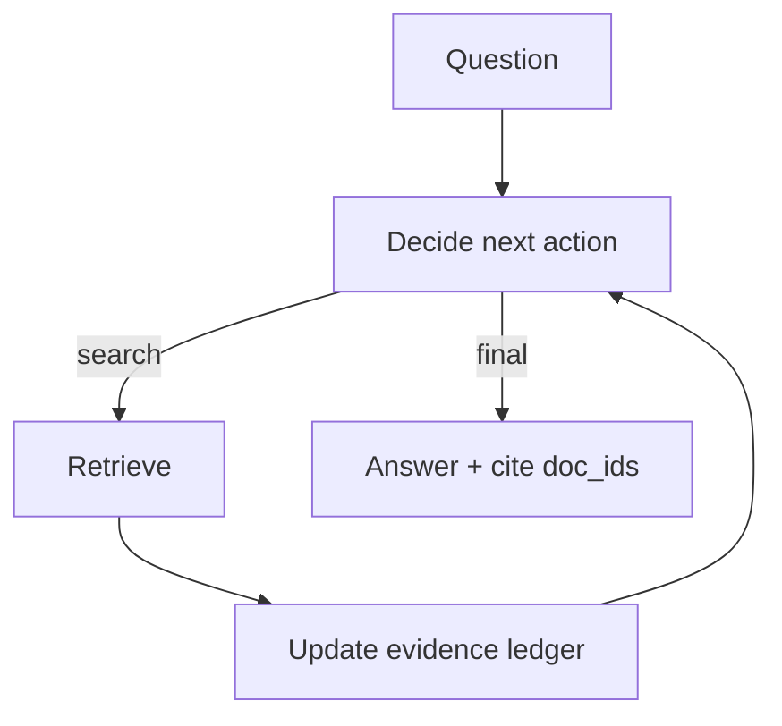

# Agentic RAG (RAG as an Agent Loop)

## What Problem It Solves

Traditional RAG is often “one retrieve → one generate”. Agentic RAG lets the model decide:

- when to retrieve
- what to retrieve
- when evidence is sufficient
- when to stop and answer

## Core Flow (ReAct + Retrieval Tool + Evidence Ledger)

## How It Works

Agentic RAG is “RAG inside an agent loop”:

1. Start with a question and an empty **evidence ledger**.
2. At each step, decide:
   - retrieve (what query?) or
   - synthesize (is evidence sufficient?) or
   - stop (final answer with citations)
3. Each retrieval updates the ledger:
   - deduplicate sources
   - track doc IDs / snippets used
   - separate evidence from instructions
4. The final answer cites ledger items, so the system can audit where claims came from.

Compared to Retrieval Loop, the difference is the **controller**:

- Retrieval Loop is “retrieve until enough, then answer”
- Agentic RAG is a general agent that *can* retrieve as needed, alongside other actions (planning, tools, verification)

## Failure Modes & Mitigations

- **Prompt injection from retrieved text**: treat retrieved text as untrusted; apply guardrails.
- **Citation gaming** (cites irrelevant docs): require claim→evidence mapping; verify citations.
- **Over-retrieval**: budgets + early-stop; cache queries; route simple queries to one-shot RAG.
- **Stale facts**: track freshness; re-retrieve when time-sensitive.

## Evolution Path

- Built on: **ReAct** + **Retrieval Loop** ideas
- Frequently combined with: **CoVe** (verify claims), **Memory** (store insights)

## Repo Reference

- Code: [`src/agent_patterns_lab/patterns/agentic_rag.py`](https://github.com/lifeodyssey/agent-patterns-lab/blob/main/src/agent_patterns_lab/patterns/agentic_rag.py)
- Example: [`examples/41_agentic_rag.py`](https://github.com/lifeodyssey/agent-patterns-lab/blob/main/examples/41_agentic_rag.py)
- Tests: [`tests/test_agentic_rag.py`](https://github.com/lifeodyssey/agent-patterns-lab/blob/main/tests/test_agentic_rag.py)
