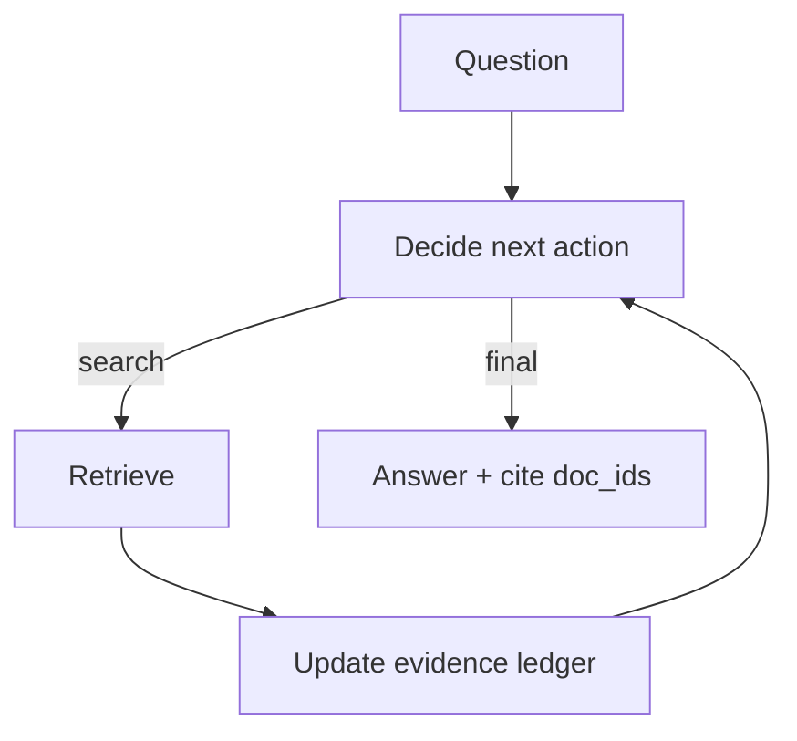

# Agentic RAG (RAG as an Agent Loop)

## TL;DR (One Sentence)

Agentic RAG is **retrieval inside an agent loop**: the model decides when/what to retrieve, keeps an evidence ledger, and stops based on explicit rules.

## You Probably Need This When (Symptoms)

- One-shot RAG answers are incomplete or unverifiable.
- You need multiple retrieval turns (“search → read → refine query → search again”).
- You need an audit trail: “which source supports which claim?”

## What Problem It Solves

Traditional RAG is often “one retrieve → one generate”. Agentic RAG lets the model decide:

- when to retrieve
- what to retrieve
- when evidence is sufficient
- when to stop and answer

## When to Use

- The question is underspecified and needs iterative retrieval.
- You need an audit trail: “which doc supports this claim?”
- You expect retrieval to be messy (mixed quality sources, partial hits, injection risk).

## When NOT to Use

- The answer is already in your prompt or a small internal KB → one-shot RAG is simpler and cheaper.
- You can’t tolerate open-ended loops → use a **bounded retrieval workflow** (fixed number of retrieves).
- You don’t need provenance/citations → adding an evidence ledger is overhead without payoff.

## Core Flow (ReAct + Retrieval Tool + Evidence Ledger)



## Walkthrough (What Happens in a Minimal Run)

Example question: “What is the capital of France?”

1. Action: retrieve
   - `{"type":"tool","tool":"search","args":{"query":"capital of France","k":2}}`
2. Observation: search returns matching docs (by `doc_id`)
3. Ledger update: store the doc(s) you actually used (deduped)
4. Final: answer **from the ledger** and cite the `doc_id`
   - `"Paris is the capital of France. [paris]"`

## How It Works

Agentic RAG is “RAG inside an agent loop”:

1. Start with a question and an empty **evidence ledger**.
2. At each step, decide:
   - retrieve (what query?) or
   - synthesize (is evidence sufficient?) or
   - stop (final answer with citations)
3. Each retrieval updates the ledger:
   - deduplicate sources
   - track doc IDs / snippets used
   - separate evidence from instructions
4. The final answer cites ledger items, so the system can audit where claims came from.

Compared to Retrieval Loop, the difference is the **controller**:

- Retrieval Loop is “retrieve until enough, then answer”
- Agentic RAG is a general agent that *can* retrieve as needed, alongside other actions (planning, tools, verification)

### Mechanics (the parts that make it shippable)

- **Evidence ledger**: store evidence as structured items (id, source, snippet, tags). Deduplicate aggressively.
- **Answer-from-ledger**: the final answer should be written from ledger items, not raw pages.
- **Claim ↔ evidence mapping**: require the model to cite doc IDs per claim (or per paragraph). This kills “citation theater”.
- **Tool policies**: treat retrieved text as untrusted input; apply guardrails before it reaches the “decide” step.
- **Budgets**: cap retrieves and add convergence rules (“no new evidence in last N steps”).

## Worked Example

```bash
UV_CACHE_DIR=.uv_cache PYTHONPATH=src uv run --no-sync python examples/41_agentic_rag.py
```

??? example "Example code (`examples/41_agentic_rag.py`)"
    ```python
    --8<-- "examples/41_agentic_rag.py"
    ```

Then inspect `.traces/41_agentic_rag.jsonl` to see retrieval decisions and ledger updates.

## Failure Modes & Mitigations

- **Prompt injection from retrieved text**: treat retrieved text as untrusted; apply guardrails.
- **Citation gaming** (cites irrelevant docs): require claim→evidence mapping; verify citations.
- **Over-retrieval**: budgets + early-stop; cache queries; route simple queries to one-shot RAG.
- **Stale facts**: track freshness; re-retrieve when time-sensitive.

## Evolution Path

- Built on: **ReAct** + **Retrieval Loop** ideas
- Frequently combined with: **CoVe** (verify claims), **Memory** (store insights)

## Repo Reference

- Code: [`src/agent_patterns_lab/patterns/agentic_rag.py`](https://github.com/lifeodyssey/agent-patterns-lab/blob/main/src/agent_patterns_lab/patterns/agentic_rag.py)
- Example: [`examples/41_agentic_rag.py`](https://github.com/lifeodyssey/agent-patterns-lab/blob/main/examples/41_agentic_rag.py)
- Tests: [`tests/test_agentic_rag.py`](https://github.com/lifeodyssey/agent-patterns-lab/blob/main/tests/test_agentic_rag.py)

## References

- IBM — Agentic RAG overview: https://www.ibm.com/think/topics/agentic-rag
- GOV.UK — Agentic RAG (risks and considerations): https://www.gov.uk/government/publications/ai-insights/ai-insights-agentic-rag-html
- ExploreAgentic — Agentic RAG glossary-style explainer: https://exploreagentic.ai/glossary/agentic-rag/
