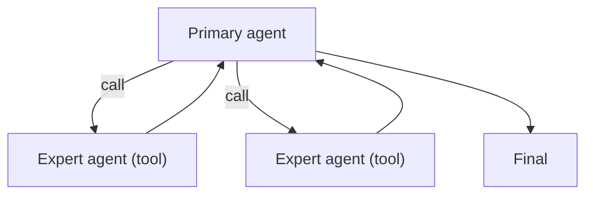

# Agents-as-Tools

## What Problem It Solves

You want specialized agents, but you don’t want to “lose the main thread”.  
Agents-as-Tools keeps a **single primary controller** and calls sub-agents like tools.

## Core Flow

## How It Works

Treat each sub-agent as a callable capability with a contract:

- **Name**: what the agent is good at (“research”, “coder”, “critic”).
- **Args**: the task input schema.
- **Observation**: a structured result the primary agent can consume.

The primary agent stays in control of global context, memory, and final synthesis, while delegating narrowly-scoped work.

## Failure Modes & Mitigations

- **Sub-agent runs away** (too many steps): enforce budgets per agent; limit max turns.
- **Loss of accountability**: require sub-agents to cite evidence or output checklists.
- **Context leakage** (sub-agent sees too much): pass minimal necessary context.
- **Tool soup** (too many agents): add routing; keep a small set of high-value experts.

## Evolution Path

- Built on: Tool calling discipline (names/args/observations)
- Often combined with: **policy/guardrails** for sub-agent access control

## Repo Reference

- Code: [`src/agent_patterns_lab/patterns/agents_as_tools.py`](https://github.com/lifeodyssey/agent-patterns-lab/blob/main/src/agent_patterns_lab/patterns/agents_as_tools.py)
- Example: [`examples/61_agents_as_tools.py`](https://github.com/lifeodyssey/agent-patterns-lab/blob/main/examples/61_agents_as_tools.py)
- Tests: [`tests/test_agents_as_tools.py`](https://github.com/lifeodyssey/agent-patterns-lab/blob/main/tests/test_agents_as_tools.py)
