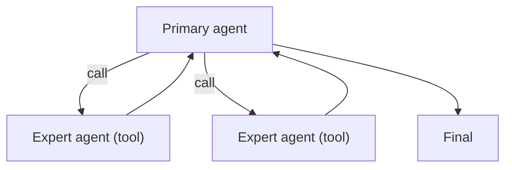

# Agents-as-Tools

## What Problem It Solves

You want specialized agents, but you don’t want to “lose the main thread”.  
Agents-as-Tools keeps a **single primary controller** and calls sub-agents like tools.

## Core Flow

## Evolution Path

- Built on: Tool calling discipline (names/args/observations)
- Often combined with: **policy/guardrails** for sub-agent access control

## Repo Reference

- Code: `src/agent_patterns_lab/patterns/agents_as_tools.py`
- Example: `examples/61_agents_as_tools.py`
- Tests: `tests/test_agents_as_tools.py`

