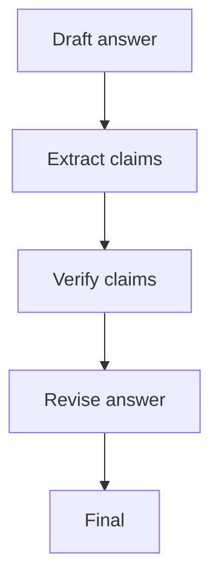

# Chain-of-Verification (CoVe)

## What Problem It Solves

Even if a draft “sounds right”, factual claims may be wrong. CoVe turns verification into a first-class step:

1. draft
2. extract checkable claims
3. verify each claim (tool/rules/human)
4. revise the draft

## Core Flow

## Evolution Path

- Extends: **Maker-Checker** by focusing on factual claims
- Often combined with: **Retrieval / Agentic RAG** for evidence gathering

## Repo Reference

- Code: `src/agent_patterns_lab/patterns/cove.py`
- Example: `examples/32_cove.py`
- Tests: `tests/test_cove.py`

