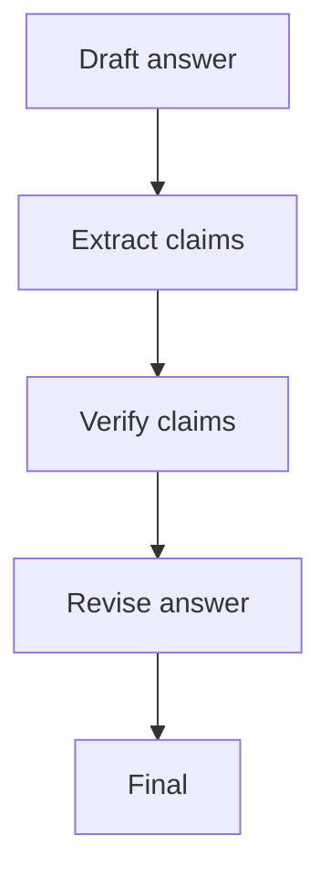

# Chain-of-Verification (CoVe)

## What Problem It Solves

Even if a draft “sounds right”, factual claims may be wrong. CoVe turns verification into a first-class step:

1. draft
2. extract checkable claims
3. verify each claim (tool/rules/human)
4. revise the draft

## When to Use

- You care about factual correctness (not just plausibility).
- The output contains multiple checkable claims (lists, comparisons, “X is Y”).
- You have a verification method (retrieval, tools, rules, or HITL).

## When NOT to Use

- You can’t verify claims (no tools, no sources, no human review) → CoVe becomes ceremony.
- The task is purely creative (fiction, tone writing) where “truth” is not the objective.
- The output is tiny and low-stakes → a simple retry or maker-checker may be cheaper.

## Core Flow



## How It Works

The key move is to treat “verification” as its own workflow:

- **Claim extraction**: convert a free-form draft into a list of checkable items.
  - good claim = specific, testable, and has a clear success/failure condition
- **Verification**: for each claim, gather evidence via:
  - retrieval/search
  - deterministic checks (math, unit conversions, constraints)
  - human approval (HITL) for high stakes
- **Revision**: update the draft so every claim is either supported or removed.

### Mechanics (what makes CoVe different from “just re-read it”)

- **Claim factoring**: break the draft into *atomic* claims that can be checked independently.
- **Evidence artifacts**: require verifiers to output evidence (doc ids, snippets, calculations), not just “seems true”.
- **Bias control**: verify claims in a way that is not anchored to the draft (e.g., answer verification questions without seeing the original phrasing).
- **Selective verification**: don’t verify everything; verify what’s risky, customer-facing, or easy to get wrong.

## Worked Example

```bash
UV_CACHE_DIR=.uv_cache PYTHONPATH=src uv run --no-sync python examples/32_cove.py
```

## Failure Modes & Mitigations

- **Missed claims**: force structured claim lists; add second-pass extraction.
- **Weak verification** (“sounds plausible”): require evidence artifacts (doc IDs, quotes, calculations).
- **Over-verification cost**: only verify high-risk claims; route simple queries to cheaper flows.
- **Stale evidence**: timestamp sources; re-check when freshness matters.

## Evolution Path

- Extends: **Maker-Checker** by focusing on factual claims
- Often combined with: **Retrieval / Agentic RAG** for evidence gathering

## Repo Reference

- Code: [`src/agent_patterns_lab/patterns/cove.py`](https://github.com/lifeodyssey/agent-patterns-lab/blob/main/src/agent_patterns_lab/patterns/cove.py)
- Example: [`examples/32_cove.py`](https://github.com/lifeodyssey/agent-patterns-lab/blob/main/examples/32_cove.py)
- Tests: [`tests/test_cove.py`](https://github.com/lifeodyssey/agent-patterns-lab/blob/main/tests/test_cove.py)

## References

- Dhuliawala et al. (2023) — *Chain-of-Verification Reduces Hallucination in Large Language Models*: https://arxiv.org/abs/2309.11495
