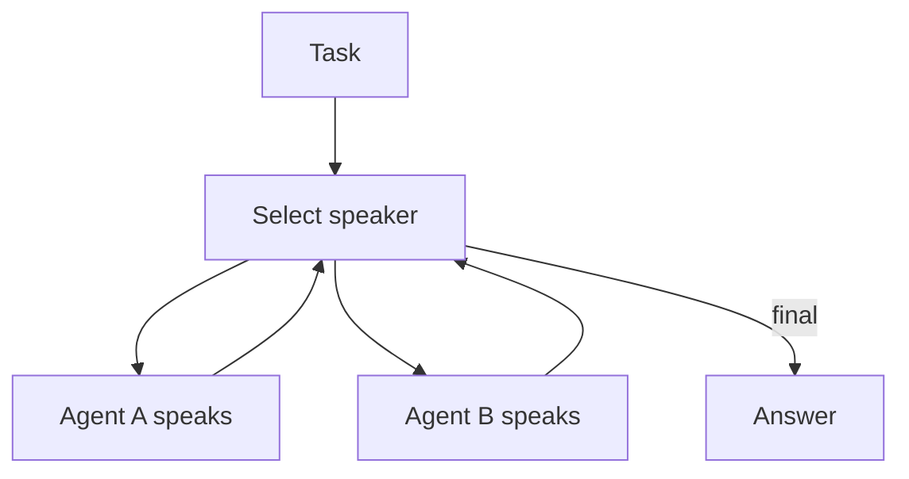

# Group Chat / Council / Debate

## What Problem It Solves

Some errors only surface under critique. Group chat patterns:

- add multiple perspectives
- enable debate/critique dynamics
- drive convergence via a speaker policy

## Two Common Schedules

- **Round-robin**: fixed speaking order.
- **Selector**: a model chooses who should speak next.

## Core Flow (Selector)

## How It Works

Group chat introduces *multiple interacting agents* under a conversation policy:

- **Speakers**: agents with distinct roles (critic, planner, implementer, safety).
- **Schedule**: who speaks next (round-robin, selector, moderator).
- **Stopping condition**: when to stop debating and produce a final answer.

The pattern helps when:

- you need critique dynamics to surface hidden mistakes
- the best answer emerges from combining partial insights

## Failure Modes & Mitigations

- **Echo chamber**: enforce role diversity; assign explicit “devil’s advocate”.
- **No convergence**: add a moderator; define a decision rule (vote, rubric, manager synthesis).
- **Cost blow-up**: cap turns; route only high-risk tasks into group chat.
- **Contradictory outputs**: require structured claims + evidence; add a merge/consistency pass.

## Evolution Path

- Comes from: Manager-Worker (but more peer-like)
- Often paired with: **verification** (CoVe) and **evals** (to control costs)

## Repo Reference

- Code: [`src/agent_patterns_lab/patterns/group_chat.py`](https://github.com/lifeodyssey/agent-patterns-lab/blob/main/src/agent_patterns_lab/patterns/group_chat.py)
- Examples: [`examples/62_group_chat_round_robin.py`](https://github.com/lifeodyssey/agent-patterns-lab/blob/main/examples/62_group_chat_round_robin.py), [`examples/63_group_chat_selector.py`](https://github.com/lifeodyssey/agent-patterns-lab/blob/main/examples/63_group_chat_selector.py)
- Tests: [`tests/test_group_chat.py`](https://github.com/lifeodyssey/agent-patterns-lab/blob/main/tests/test_group_chat.py)
