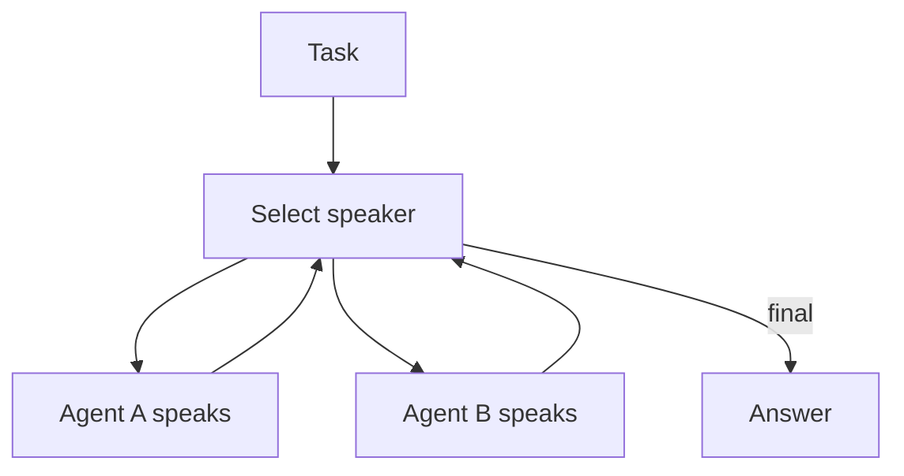

# Group Chat / Council / Debate

## What Problem It Solves

Some errors only surface under critique. Group chat patterns:

- add multiple perspectives
- enable debate/critique dynamics
- drive convergence via a speaker policy

## When to Use

- You want critique dynamics (not just parallelization).
- The task benefits from role separation (planner vs. critic vs. implementer).
- You can afford extra tokens to buy safety/coverage.

## When NOT to Use

- You just want multiple independent takes → **concurrent** fan-out/fan-in is cheaper than debate.
- The process must be deterministic and reproducible → use a workflow (sequential) or manager-worker.
- You don’t have a clear stopping rule → group chat will happily talk forever.

## Two Common Schedules

- **Round-robin**: fixed speaking order.
- **Selector**: a model chooses who should speak next.

## Core Flow (Selector)



## How It Works

Group chat introduces *multiple interacting agents* under a conversation policy:

- **Speakers**: agents with distinct roles (critic, planner, implementer, safety).
- **Schedule**: who speaks next (round-robin, selector, moderator).
- **Stopping condition**: when to stop debating and produce a final answer.

The pattern helps when:

- you need critique dynamics to surface hidden mistakes
- the best answer emerges from combining partial insights

### Mechanics (what you need to define)

- **Topology**: usually a shared thread + a manager/moderator (star), not a free-for-all mesh.
- **Speaker selection**: round-robin for predictability; selector for adaptivity (but harder to debug).
- **Summaries**: periodically summarize the conversation into a ledger to avoid context bloat.
- **Decision rule**: vote, manager synthesis, or “one final author” that integrates the debate.

## Worked Example

Round-robin:

```bash
UV_CACHE_DIR=.uv_cache PYTHONPATH=src uv run --no-sync python examples/62_group_chat_round_robin.py
```

Selector:

```bash
UV_CACHE_DIR=.uv_cache PYTHONPATH=src uv run --no-sync python examples/63_group_chat_selector.py
```

## Failure Modes & Mitigations

- **Echo chamber**: enforce role diversity; assign explicit “devil’s advocate”.
- **No convergence**: add a moderator; define a decision rule (vote, rubric, manager synthesis).
- **Cost blow-up**: cap turns; route only high-risk tasks into group chat.
- **Contradictory outputs**: require structured claims + evidence; add a merge/consistency pass.

## Evolution Path

- Comes from: Manager-Worker (but more peer-like)
- Often paired with: **verification** (CoVe) and **evals** (to control costs)

## Repo Reference

- Code: [`src/agent_patterns_lab/patterns/group_chat.py`](https://github.com/lifeodyssey/agent-patterns-lab/blob/main/src/agent_patterns_lab/patterns/group_chat.py)
- Examples: [`examples/62_group_chat_round_robin.py`](https://github.com/lifeodyssey/agent-patterns-lab/blob/main/examples/62_group_chat_round_robin.py), [`examples/63_group_chat_selector.py`](https://github.com/lifeodyssey/agent-patterns-lab/blob/main/examples/63_group_chat_selector.py)
- Tests: [`tests/test_group_chat.py`](https://github.com/lifeodyssey/agent-patterns-lab/blob/main/tests/test_group_chat.py)

## References

- AutoGen — Group Chat pattern overview: https://microsoft.github.io/autogen/0.4.5/user-guide/core-user-guide/design-patterns/group-chat.html
- Microsoft Agent Framework — Group Chat orchestration: https://learn.microsoft.com/en-us/agent-framework/user-guide/workflows/orchestrations/group-chat
- Azure Architecture Center — AI agent orchestration patterns (group chat trade-offs): https://learn.microsoft.com/en-us/azure/architecture/ai-ml/guide/ai-agent-design-patterns
