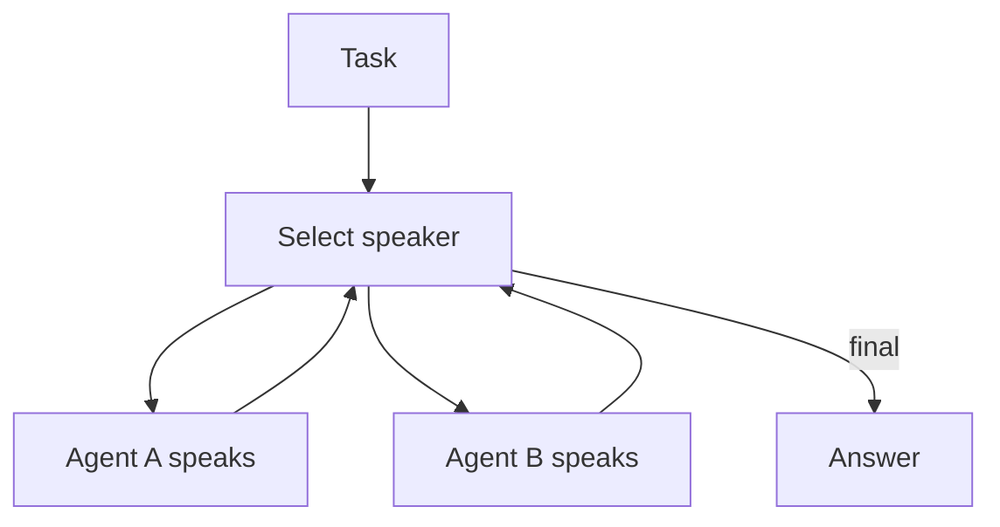

# Group Chat / Council / Debate

## What Problem It Solves

Some errors only surface under critique. Group chat patterns:

- add multiple perspectives
- enable debate/critique dynamics
- drive convergence via a speaker policy

## Two Common Schedules

- **Round-robin**: fixed speaking order.
- **Selector**: a model chooses who should speak next.

## Core Flow (Selector)

## Evolution Path

- Comes from: Manager-Worker (but more peer-like)
- Often paired with: **verification** (CoVe) and **evals** (to control costs)

## Repo Reference

- Code: `src/agent_patterns_lab/patterns/group_chat.py`
- Examples: `examples/62_group_chat_round_robin.py`, `examples/63_group_chat_selector.py`
- Tests: `tests/test_group_chat.py`

