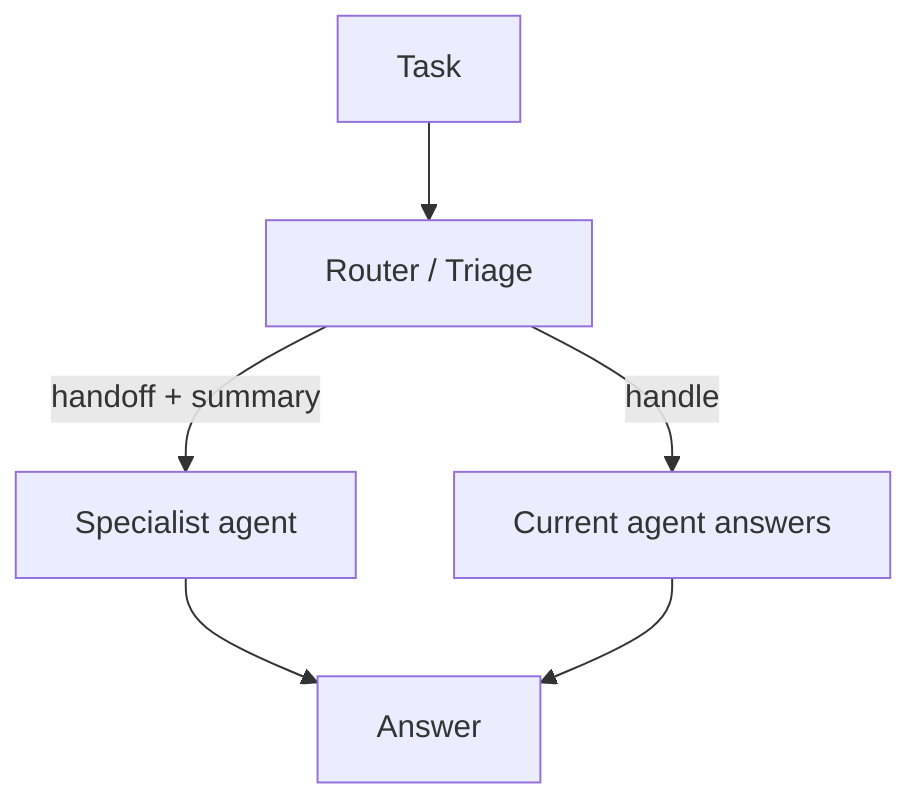

# Handoff (Triage / Escalation)

## What Problem It Solves

Sometimes the current agent is the wrong “owner”:

- wrong expertise
- wrong tool access
- wrong risk profile

Handoff makes escalation explicit: **handoff to X with a summary**.

## Core Flow

## How It Works

A good handoff includes a **compact, structured summary**:

- user intent + constraints
- what’s been tried
- key artifacts (links, files, intermediate results)
- open questions / next actions

This lets the specialist agent start fast without rereading the entire transcript.

## Failure Modes & Mitigations

- **Context loss**: standardize the handoff summary schema; include the minimal critical artifacts.
- **Ping-pong** between agents: define ownership; cap handoff depth; add a manager to arbitrate.
- **Privilege escalation**: combine with policy/guardrails so handoff doesn’t bypass permissions.
- **Over-handoff**: route only when confidence is low or the cost of being wrong is high.

## Evolution Path

- A routing pattern between agents (works well with manager-worker)
- Often combined with: governance (different agents have different permissions)

## Repo Reference

- Code: [`src/agent_patterns_lab/patterns/handoff.py`](https://github.com/lifeodyssey/agent-patterns-lab/blob/main/src/agent_patterns_lab/patterns/handoff.py)
- Example: [`examples/64_handoff.py`](https://github.com/lifeodyssey/agent-patterns-lab/blob/main/examples/64_handoff.py)
- Tests: [`tests/test_handoff_pattern.py`](https://github.com/lifeodyssey/agent-patterns-lab/blob/main/tests/test_handoff_pattern.py)
