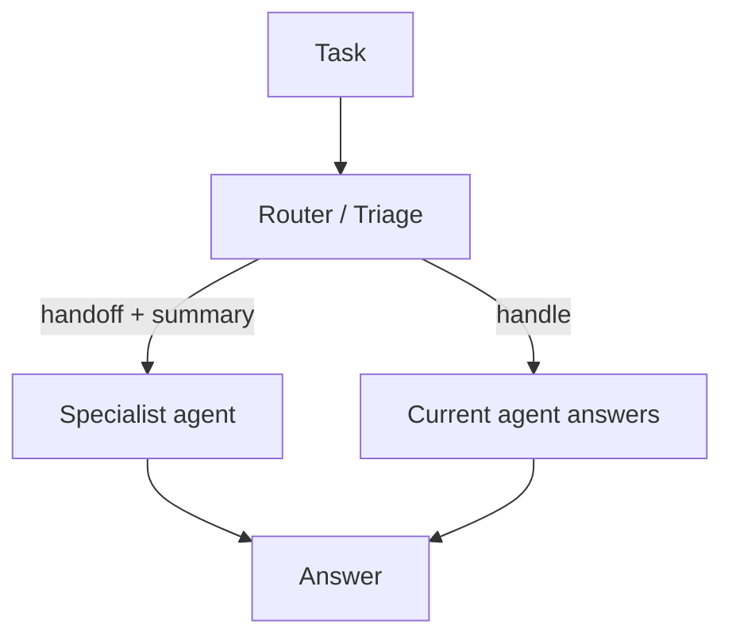

# Handoff (Triage / Escalation)

## What Problem It Solves

Sometimes the current agent is the wrong “owner”:

- wrong expertise
- wrong tool access
- wrong risk profile

Handoff makes escalation explicit: **handoff to X with a summary**.

## Core Flow

## Evolution Path

- A routing pattern between agents (works well with manager-worker)
- Often combined with: governance (different agents have different permissions)

## Repo Reference

- Code: `src/agent_patterns_lab/patterns/handoff.py`
- Example: `examples/64_handoff.py`
- Tests: `tests/test_handoff_pattern.py`

