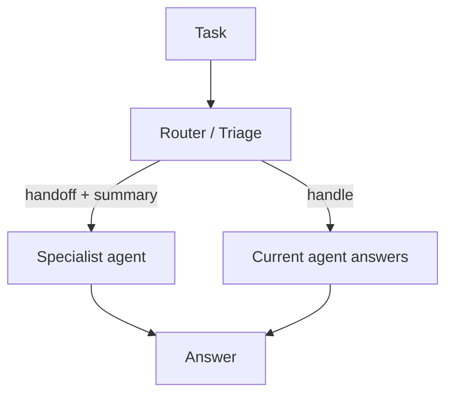

# Handoff (Triage / Escalation)

## What Problem It Solves

Sometimes the current agent is the wrong “owner”:

- wrong expertise
- wrong tool access
- wrong risk profile

Handoff makes escalation explicit: **handoff to X with a summary**.

## When to Use

- The current agent lacks expertise, tools, or permissions.
- The cost of being wrong is high (escalate instead of guessing).
- You need a clean ownership boundary for responsibility and auditing.

## When NOT to Use

- The right specialist is obvious from the first message → do **deterministic routing** (don’t “handoff hop”).
- You want a primary agent to remain the owner and just delegate subtasks → use **agents-as-tools**.
- You can’t prevent handoff loops → add a manager/moderator first (or keep it single-agent).

## Core Flow



## How It Works

A good handoff includes a **compact, structured summary**:

- user intent + constraints
- what’s been tried
- key artifacts (links, files, intermediate results)
- open questions / next actions

This lets the specialist agent start fast without rereading the entire transcript.

### Mechanics (what makes handoff safe)

- **Summary schema**: define required fields (intent, constraints, artifacts, open questions).
- **Routing signals**: use confidence thresholds + “capability limits” (e.g., tool access, language, domain).
- **Loop control**: cap maximum handoffs; track who owned what and why the handoff happened.
- **Permission boundaries**: handoff must not bypass tool policy; permissions should be explicit per agent.

## Worked Example

```bash
UV_CACHE_DIR=.uv_cache PYTHONPATH=src uv run --no-sync python examples/64_handoff.py
```

## Failure Modes & Mitigations

- **Context loss**: standardize the handoff summary schema; include the minimal critical artifacts.
- **Ping-pong** between agents: define ownership; cap handoff depth; add a manager to arbitrate.
- **Privilege escalation**: combine with policy/guardrails so handoff doesn’t bypass permissions.
- **Over-handoff**: route only when confidence is low or the cost of being wrong is high.

## Evolution Path

- A routing pattern between agents (works well with manager-worker)
- Often combined with: governance (different agents have different permissions)

## Repo Reference

- Code: [`src/agent_patterns_lab/patterns/handoff.py`](https://github.com/lifeodyssey/agent-patterns-lab/blob/main/src/agent_patterns_lab/patterns/handoff.py)
- Example: [`examples/64_handoff.py`](https://github.com/lifeodyssey/agent-patterns-lab/blob/main/examples/64_handoff.py)
- Tests: [`tests/test_handoff_pattern.py`](https://github.com/lifeodyssey/agent-patterns-lab/blob/main/tests/test_handoff_pattern.py)

## References

- Azure Architecture Center — Handoff orchestration: https://learn.microsoft.com/en-us/azure/architecture/ai-ml/guide/ai-agent-design-patterns
- Microsoft Agent Framework — Handoff orchestration: https://learn.microsoft.com/en-us/agent-framework/user-guide/workflows/orchestrations/handoff
