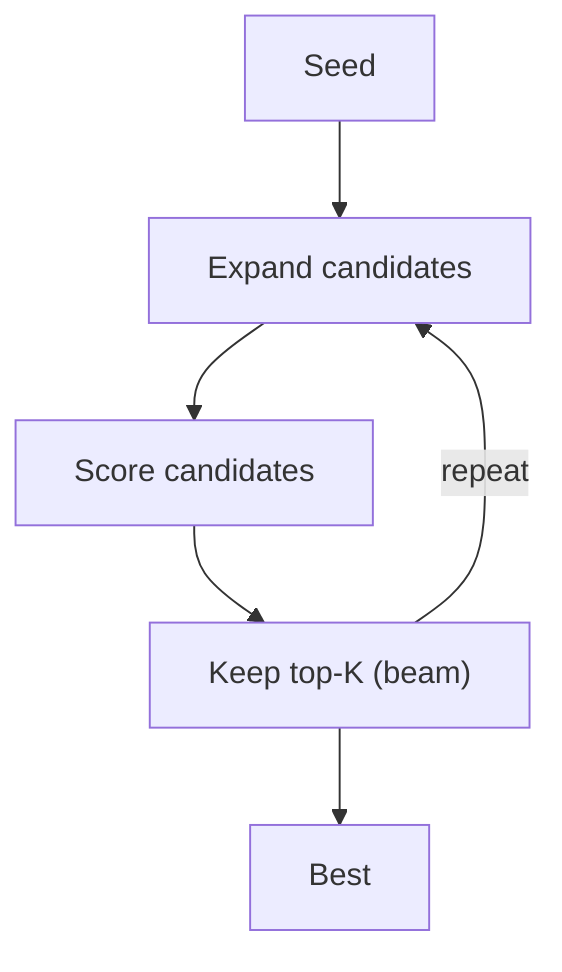

# LATS (Tree/Beam Search Over Solutions)

## What Problem It Solves

If “reasoning” is a search space, you can improve results via:

- expand candidate solutions
- score them
- keep the best and iterate

## Core Flow

## Evolution Path

- Complements: Plan-based methods (Plan & Solve, PER)
- Often combined with: **strong evaluator** (rubrics, unit tests, tools)

## Repo Reference

- Code: `src/agent_patterns_lab/patterns/lats.py`
- Example: `examples/54_lats.py`
- Tests: `tests/test_lats.py`

