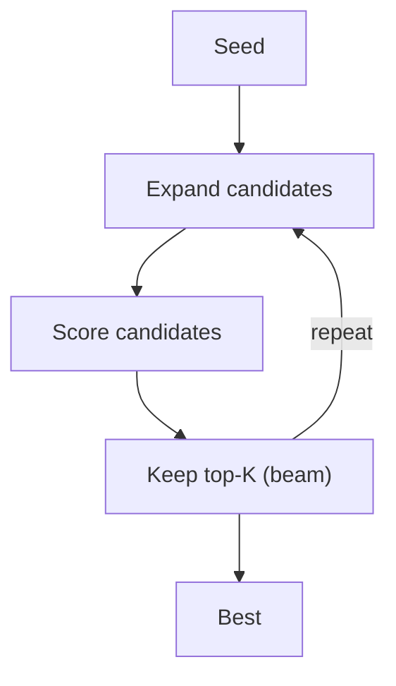

# LATS (Tree/Beam Search Over Solutions)

## What Problem It Solves

If “reasoning” is a search space, you can improve results via:

- expand candidate solutions
- score them
- keep the best and iterate

## Core Flow

## How It Works

Treat candidate solutions as nodes in a search tree:

1. Start with a seed solution (or partial plan).
2. **Expand**: generate variants (different reasoning paths, different tool strategies).
3. **Score**: evaluate candidates using a rubric, tests, or tool-based checks.
4. Keep top-K (beam) and iterate until budget is exhausted.

This is powerful when a single chain-of-thought is unreliable but evaluation is feasible.

## Failure Modes & Mitigations

- **Combinatorial explosion**: cap depth, cap branching, cap total nodes; use beam search.
- **Evaluator bias**: diversify scoring (multiple rubrics), include ground-truth checks when possible.
- **Gaming the scorer**: keep scorer rules explicit; verify with independent signals (tests/tools).
- **High cost**: route only hard tasks into LATS; cache partial results.

## Evolution Path

- Complements: Plan-based methods (Plan & Solve, PER)
- Often combined with: **strong evaluator** (rubrics, unit tests, tools)

## Repo Reference

- Code: [`src/agent_patterns_lab/patterns/lats.py`](https://github.com/lifeodyssey/agent-patterns-lab/blob/main/src/agent_patterns_lab/patterns/lats.py)
- Example: [`examples/54_lats.py`](https://github.com/lifeodyssey/agent-patterns-lab/blob/main/examples/54_lats.py)
- Tests: [`tests/test_lats.py`](https://github.com/lifeodyssey/agent-patterns-lab/blob/main/tests/test_lats.py)
