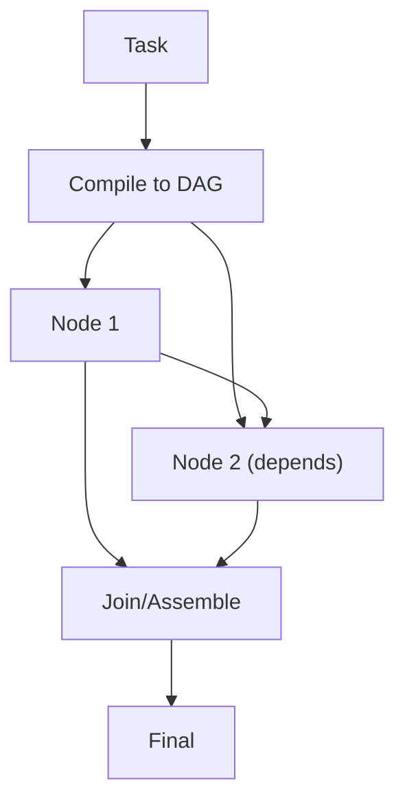

# LLM Compiler (Compile to DAG)

## What Problem It Solves

Some tasks have **dependencies** and can be parallelized. LLM Compiler:

- compiles a plan into a DAG (tasks + deps)
- executes nodes topologically
- assembles the final result

## When to Use

- The task naturally decomposes into dependent subtasks (graph, not just a list).
- You want concurrency (run independent nodes in parallel).
- You want explicit artifacts per node (easier debugging + evals).

## When NOT to Use

- You only have 1–3 tool calls and no real parallelism → a simple workflow or REWOO is cheaper.
- Dependencies are unknown until you observe results → use PER or ReAct.
- Your tools are stateful and order-sensitive (side effects) → parallel execution can cause subtle bugs.

## Core Flow



## How It Works

LLM Compiler externalizes execution structure:

1. **Compile**: the model emits a DAG spec:
   - node id / description
   - inputs/outputs
   - dependencies
2. **Execute**: run nodes in topological order (or parallelize independent nodes).
3. **Join**: assemble node outputs into a final artifact (report, code, decision).

The benefit over linear plans is concurrency and explicit dependency tracking.

### Mechanics (what you must validate)

- **DAG schema**: nodes have `id`, `tool`, `args`, `deps`, `outputs`.
- **Graph invariants**: must be acyclic; deps must exist; args must reference available outputs.
- **Execution policy**: topological order + bounded parallelism; handle partial failures per node.
- **Join contract**: join reads *node outputs*, not raw tool logs; keep outputs small and typed.

## Worked Example

```bash
UV_CACHE_DIR=.uv_cache PYTHONPATH=src uv run --no-sync python examples/53_llm_compiler.py
```

## Failure Modes & Mitigations

- **Wrong dependencies**: add a “graph review” pass; enforce schemas and invariants.
- **Cycles / invalid graphs**: validate DAG; fall back to linear execution if needed.
- **Join step loses context**: use a stable output schema per node; store summaries.
- **Non-determinism**: cache node outputs; add evals at the DAG level.

## Evolution Path

- Extends: Plan & Solve into an explicit execution graph
- Pairs well with: **caching** and **evals** (graph regressions are subtle)

## Repo Reference

- Code: [`src/agent_patterns_lab/patterns/llm_compiler.py`](https://github.com/lifeodyssey/agent-patterns-lab/blob/main/src/agent_patterns_lab/patterns/llm_compiler.py)
- Example: [`examples/53_llm_compiler.py`](https://github.com/lifeodyssey/agent-patterns-lab/blob/main/examples/53_llm_compiler.py)
- Tests: [`tests/test_llm_compiler.py`](https://github.com/lifeodyssey/agent-patterns-lab/blob/main/tests/test_llm_compiler.py)

## References

- Kim et al. (2023). *An LLM Compiler for Parallel Function Calling*: https://arxiv.org/abs/2312.04511
- Agent Patterns — LLM Compiler pattern page: https://agent-patterns.readthedocs.io/en/stable/patterns/llm-compiler.html
