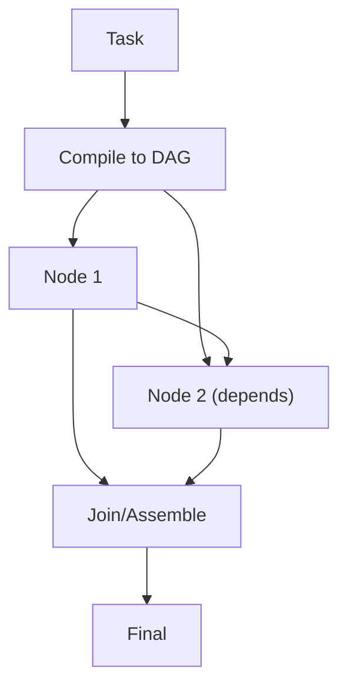

# LLM Compiler (Compile to DAG)

## What Problem It Solves

Some tasks have **dependencies** and can be parallelized. LLM Compiler:

- compiles a plan into a DAG (tasks + deps)
- executes nodes topologically
- assembles the final result

## Core Flow

## Evolution Path

- Extends: Plan & Solve into an explicit execution graph
- Pairs well with: **caching** and **evals** (graph regressions are subtle)

## Repo Reference

- Code: `src/agent_patterns_lab/patterns/llm_compiler.py`
- Example: `examples/53_llm_compiler.py`
- Tests: `tests/test_llm_compiler.py`

