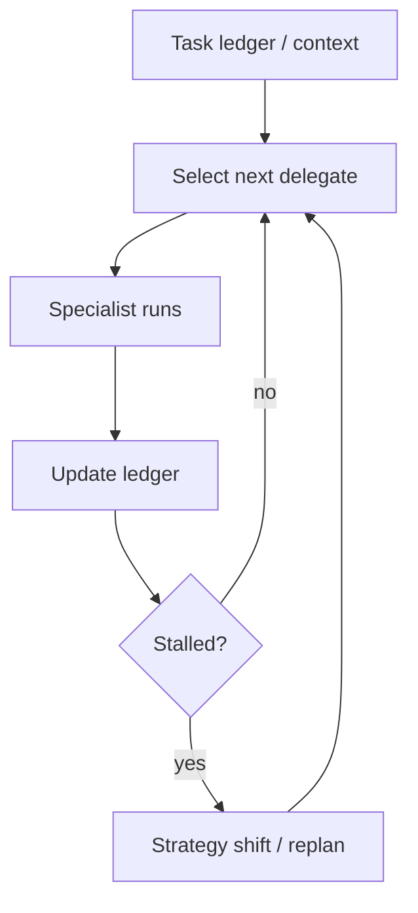

# Magentic Orchestration (Task Ledger + Stall Detection)

## What Problem It Solves

For open-domain tasks, fixed decomposition is brittle. Magentic-style orchestration:

- tracks a task ledger (implicit in messages here)
- delegates dynamically to specialists
- detects stalls (repeating the same delegation)

## Core Flow

## Evolution Path

- Generalizes: Manager-Worker (dynamic instead of fixed)
- Works best with: tracing + governance + evals (otherwise it can drift)

## Repo Reference

- Code: `src/agent_patterns_lab/patterns/magentic_orchestration.py`
- Example: `examples/65_magentic_orchestration.py`
- Tests: `tests/test_magentic_orchestration.py`

