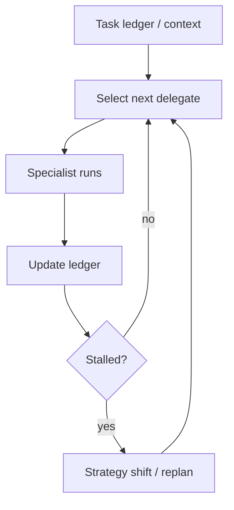

# Magentic Orchestration (Task Ledger + Stall Detection)

## What Problem It Solves

For open-domain tasks, fixed decomposition is brittle. Magentic-style orchestration:

- tracks a task ledger (implicit in messages here)
- delegates dynamically to specialists
- detects stalls (repeating the same delegation)

## Core Flow

## How It Works

Magentic-style orchestration centers on a **task ledger**:

- tasks / subtasks with status (todo / doing / done)
- hypotheses and decisions
- artifacts (notes, citations, code pointers)
- budgets (time, tool calls, cost)

Each cycle:

1. Select the next delegate/role based on ledger gaps.
2. Run the specialist with a narrow objective.
3. Update the ledger with results.
4. Detect stalls (no new progress) and trigger a strategy shift.

## Failure Modes & Mitigations

- **Ledger drift**: keep ledger schema small; require updates to be concrete and verifiable.
- **Stall false positives**: tune stall heuristics (repeated actions, no new artifacts); allow manual override.
- **Runaway delegation**: cap total cycles; require “progress evidence” per cycle.
- **Security holes**: combine with policy/guardrails so delegation doesn’t bypass constraints.

## Evolution Path

- Generalizes: Manager-Worker (dynamic instead of fixed)
- Works best with: tracing + governance + evals (otherwise it can drift)

## Repo Reference

- Code: [`src/agent_patterns_lab/patterns/magentic_orchestration.py`](https://github.com/lifeodyssey/agent-patterns-lab/blob/main/src/agent_patterns_lab/patterns/magentic_orchestration.py)
- Example: [`examples/65_magentic_orchestration.py`](https://github.com/lifeodyssey/agent-patterns-lab/blob/main/examples/65_magentic_orchestration.py)
- Tests: [`tests/test_magentic_orchestration.py`](https://github.com/lifeodyssey/agent-patterns-lab/blob/main/tests/test_magentic_orchestration.py)
