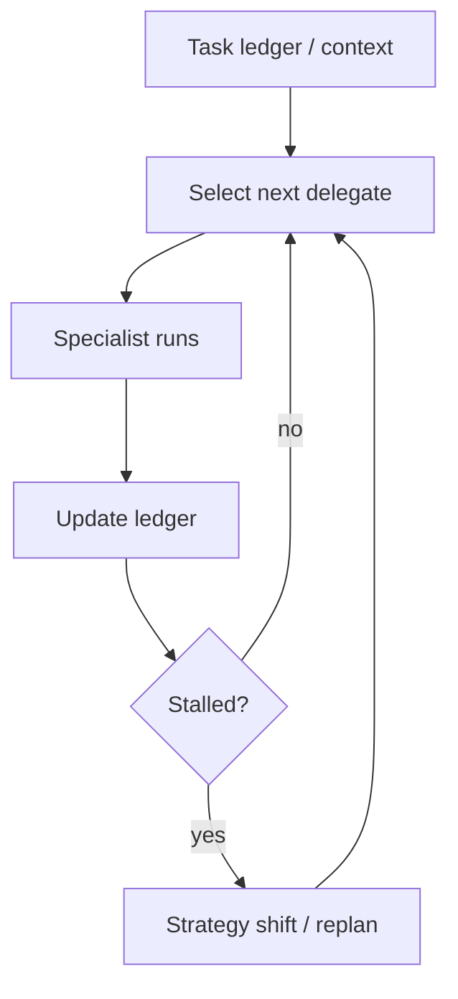

# Magentic Orchestration (Task Ledger + Stall Detection)

## What Problem It Solves

For open-domain tasks, fixed decomposition is brittle. Magentic-style orchestration:

- tracks a task ledger (implicit in messages here)
- delegates dynamically to specialists
- detects stalls (repeating the same delegation)

## When to Use

- Open-ended tasks where “one plan” is likely to be wrong.
- You need explicit progress tracking (task ledger + artifacts).
- You expect stalls and need a strategy-shift mechanism.

## When NOT to Use

- The solution path is deterministic → a workflow or manager-worker is cheaper and easier to test.
- There’s no need for a ledger / progress trace → don’t pay for it.
- The task is time-sensitive → Magentic-style systems spend tokens on planning + coordination.

## Core Flow



## How It Works

Magentic-style orchestration centers on a **task ledger**:

- tasks / subtasks with status (todo / doing / done)
- hypotheses and decisions
- artifacts (notes, citations, code pointers)
- budgets (time, tool calls, cost)

Each cycle:

1. Select the next delegate/role based on ledger gaps.
2. Run the specialist with a narrow objective.
3. Update the ledger with results.
4. Detect stalls (no new progress) and trigger a strategy shift.

### Mechanics (what makes it different from “just group chat”)

- **Ledger as the source of truth**: the manager reads/writes a structured ledger, not only a chat transcript.
- **Progress evidence**: each cycle must produce a new artifact (note, decision, code change, verified claim) or it’s counted as “no progress”.
- **Stall detection**: define stall heuristics (repeating the same tool/agent, no new artifacts, oscillating plans).
- **Strategy shift**: when stalled, the manager changes approach (new decomposition, different toolset, ask for human input).

## Worked Example

```bash
UV_CACHE_DIR=.uv_cache PYTHONPATH=src uv run --no-sync python examples/65_magentic_orchestration.py
```

## Failure Modes & Mitigations

- **Ledger drift**: keep ledger schema small; require updates to be concrete and verifiable.
- **Stall false positives**: tune stall heuristics (repeated actions, no new artifacts); allow manual override.
- **Runaway delegation**: cap total cycles; require “progress evidence” per cycle.
- **Security holes**: combine with policy/guardrails so delegation doesn’t bypass constraints.

## Evolution Path

- Generalizes: Manager-Worker (dynamic instead of fixed)
- Works best with: tracing + governance + evals (otherwise it can drift)

## Repo Reference

- Code: [`src/agent_patterns_lab/patterns/magentic_orchestration.py`](https://github.com/lifeodyssey/agent-patterns-lab/blob/main/src/agent_patterns_lab/patterns/magentic_orchestration.py)
- Example: [`examples/65_magentic_orchestration.py`](https://github.com/lifeodyssey/agent-patterns-lab/blob/main/examples/65_magentic_orchestration.py)
- Tests: [`tests/test_magentic_orchestration.py`](https://github.com/lifeodyssey/agent-patterns-lab/blob/main/tests/test_magentic_orchestration.py)

## References

- Azure Architecture Center — Magentic orchestration: https://learn.microsoft.com/en-us/azure/architecture/ai-ml/guide/ai-agent-design-patterns
- Microsoft Agent Framework — Magentic orchestration: https://learn.microsoft.com/en-us/agent-framework/user-guide/workflows/orchestrations/magentic
- Fourney et al. (2024). *Magentic-One*: https://arxiv.org/abs/2411.04468
