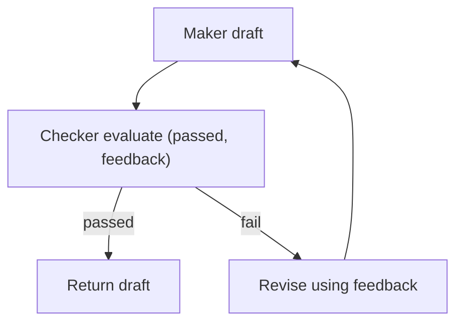

# Maker-Checker (Evaluator-Optimizer)

## What Problem It Solves

Models produce drafts; you often need a **quality gate**:

- correctness rubric
- safety requirements
- formatting constraints

Maker-Checker adds an explicit verification step and revision loop.

## When to Use

- Errors are costly (financial/legal/security/production incidents).
- You can define a **rubric** (what “good” means).
- You want repeatable quality improvement, not just “try again”.

## Core Flow

## How It Works

1. **Maker** produces a draft.
2. **Checker** evaluates against a rubric and returns:
   - `passed: true/false`
   - feedback items (what’s wrong, what to fix)
3. If failed, the Maker revises using feedback and repeats.

The key design choice is that the checker output is **structured and actionable**, so the revision step is guided.

## Failure Modes & Mitigations

- **Maker/Checker “collusion”**: use different prompts, temperatures, or even different models.
- **Vague feedback**: force the checker to output concrete, testable issues.
- **Infinite revisions**: enforce max rounds and “good enough” thresholds.
- **Cost blow-up**: cache checker results; add early-stop and narrower rubrics.

## Evolution Path

- Comes from: “single draft” generation
- Often combined with: **Voting**, **CoVe**, **Retrieval**

## Repo Reference

- Code: [`src/agent_patterns_lab/patterns/maker_checker.py`](https://github.com/lifeodyssey/agent-patterns-lab/blob/main/src/agent_patterns_lab/patterns/maker_checker.py)
- Example: [`examples/30_maker_checker.py`](https://github.com/lifeodyssey/agent-patterns-lab/blob/main/examples/30_maker_checker.py)
- Tests: [`tests/test_maker_checker.py`](https://github.com/lifeodyssey/agent-patterns-lab/blob/main/tests/test_maker_checker.py)
