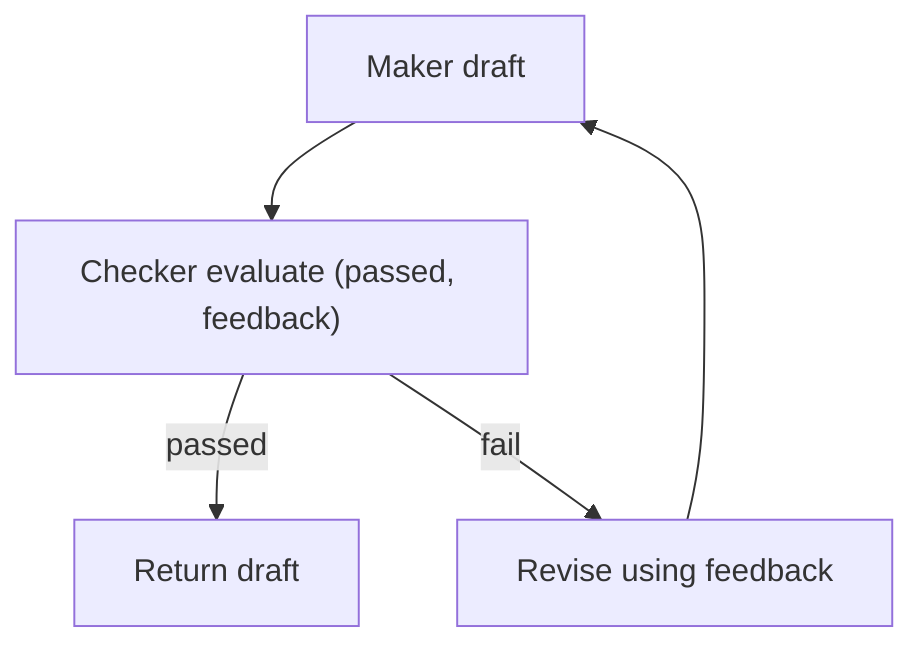

# Maker-Checker (Evaluator-Optimizer)

## What Problem It Solves

Models produce drafts; you often need a **quality gate**:

- correctness rubric
- safety requirements
- formatting constraints

Maker-Checker adds an explicit verification step and revision loop.

## Core Flow

## Evolution Path

- Comes from: “single draft” generation
- Often combined with: **Voting**, **CoVe**, **Retrieval**

## Repo Reference

- Code: `src/agent_patterns_lab/patterns/maker_checker.py`
- Example: `examples/30_maker_checker.py`
- Tests: `tests/test_maker_checker.py`

