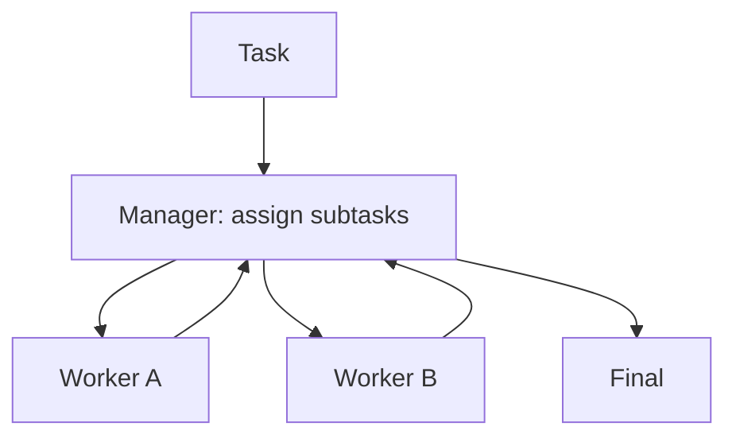

# Manager-Worker (Orchestrator-Workers)

## What Problem It Solves

When tasks require multiple specialties, a single agent struggles.  
Manager-Worker introduces:

- a manager to decompose/assign
- workers to execute subtasks
- a manager synthesis step

## Core Flow

## How It Works

Manager-Worker makes coordination explicit:

1. The **manager** decomposes the task into subtasks with clear interfaces (inputs/outputs/acceptance).
2. Each **worker** executes one subtask, often with specialized tools/prompts.
3. The manager aggregates results, resolves conflicts, and produces the final output.

This pattern scales well when subtasks can run in parallel and the manager can validate integration.

## Failure Modes & Mitigations

- **Bad decomposition**: add a decomposition rubric; allow manager to re-split tasks after seeing worker outputs.
- **Duplicate work**: assign ownership per worker; track a task ledger.
- **Integration conflicts**: require structured worker outputs; add a merge/consistency pass.
- **Context overload**: keep worker context minimal; summarize results back to manager.

## Evolution Path

- Comes from: routing + specialization
- Often combined with: **agents-as-tools**, **group chat**, **handoff**

## Repo Reference

- Code: [`src/agent_patterns_lab/patterns/manager_worker.py`](https://github.com/lifeodyssey/agent-patterns-lab/blob/main/src/agent_patterns_lab/patterns/manager_worker.py)
- Example: [`examples/60_manager_worker.py`](https://github.com/lifeodyssey/agent-patterns-lab/blob/main/examples/60_manager_worker.py)
- Tests: [`tests/test_manager_worker.py`](https://github.com/lifeodyssey/agent-patterns-lab/blob/main/tests/test_manager_worker.py)
