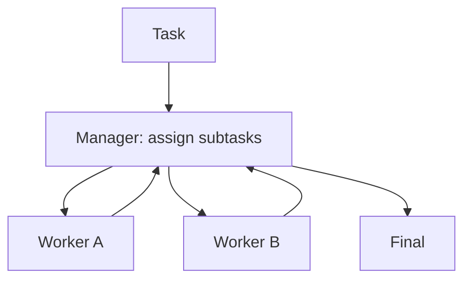

# Manager-Worker (Orchestrator-Workers)

## TL;DR (One Sentence)

Manager-Worker splits a hard task into **delegated subtasks**: a manager assigns work to specialists, then merges results into one final output.

## You Probably Need This When (Symptoms)

- The task naturally decomposes into “mostly independent” chunks.
- You want specialization (different tools/prompts) but still one coherent final answer.
- You want debuggability: failures should map to a specific worker step.

## What Problem It Solves

When tasks require multiple specialties, a single agent struggles.  
Manager-Worker introduces:

- a manager to decompose/assign
- workers to execute subtasks
- a manager synthesis step

## When to Use

- The task naturally decomposes into independent-ish subtasks.
- You want parallelism and specialization without losing a single final “owner”.
- You want clearer debugging: failures map to a specific worker step.

## When NOT to Use

- The task is basically linear and each step depends on the previous → a workflow (or PER) is simpler.
- Workers need to coordinate tightly on shared state → you’ll fight conflicts; use a single agent + tools or a group chat with strong control.
- The manager can’t reliably validate integration → you’ll ship stitched-together nonsense.

## Core Flow



## Walkthrough (What a “Good” Delegation Looks Like)

1. Manager assigns two subtasks with explicit I/O:
   - Worker A: “extract facts → return JSON `{facts:[...]}`”
   - Worker B: “draft outline → return JSON `{outline:[...]}`”
2. Workers run independently (possibly with different tools/prompts).
3. Manager merges structured outputs and resolves conflicts (or re-asks one worker).

If the manager can’t state the I/O contract, the system usually devolves into “two agents chatting” and the results get hard to trust.

## How It Works

Manager-Worker makes coordination explicit:

1. The **manager** decomposes the task into subtasks with clear interfaces (inputs/outputs/acceptance).
2. Each **worker** executes one subtask, often with specialized tools/prompts.
3. The manager aggregates results, resolves conflicts, and produces the final output.

This pattern scales well when subtasks can run in parallel and the manager can validate integration.

### Mechanics (what makes delegation actually work)

- **Task spec**: manager assigns subtasks with explicit I/O (“return JSON with fields X/Y/Z”).
- **Ownership**: one worker owns one subtask; avoid duplication unless you *intentionally* want redundancy.
- **Aggregation**: manager merges structured worker outputs; if outputs conflict, trigger a resolver step (or re-ask one worker).
- **Budgets**: cap worker calls; parallelism can hide cost blowups.

## Worked Example

```bash
UV_CACHE_DIR=.uv_cache PYTHONPATH=src uv run --no-sync python examples/60_manager_worker.py
```

??? example "Example code (`examples/60_manager_worker.py`)"
    ```python
    --8<-- "examples/60_manager_worker.py"
    ```

## Failure Modes & Mitigations

- **Bad decomposition**: add a decomposition rubric; allow manager to re-split tasks after seeing worker outputs.
- **Duplicate work**: assign ownership per worker; track a task ledger.
- **Integration conflicts**: require structured worker outputs; add a merge/consistency pass.
- **Context overload**: keep worker context minimal; summarize results back to manager.

## Evolution Path

- Comes from: routing + specialization
- Often combined with: **agents-as-tools**, **group chat**, **handoff**

## Repo Reference

- Code: [`src/agent_patterns_lab/patterns/manager_worker.py`](https://github.com/lifeodyssey/agent-patterns-lab/blob/main/src/agent_patterns_lab/patterns/manager_worker.py)
- Example: [`examples/60_manager_worker.py`](https://github.com/lifeodyssey/agent-patterns-lab/blob/main/examples/60_manager_worker.py)
- Tests: [`tests/test_manager_worker.py`](https://github.com/lifeodyssey/agent-patterns-lab/blob/main/tests/test_manager_worker.py)

## References

- Agent Patterns — Orchestrator Agent (manager/worker style): https://www.agentpatterns.tech/en/agent-patterns/orchestrator-agent
- Azure Architecture Center — AI agent orchestration patterns (concurrent / multi-agent trade-offs): https://learn.microsoft.com/en-us/azure/architecture/ai-ml/guide/ai-agent-design-patterns
